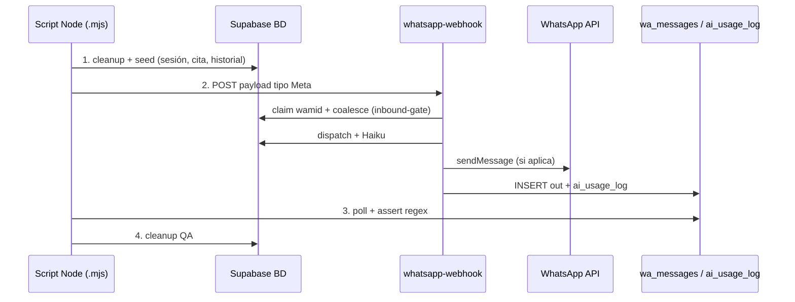

# Guía — Validación WABA por simulación de chats

Herramienta operativa para **reproducir conversaciones WhatsApp sin escribir desde un teléfono real**: se arma el estado en BD, se envía el payload que Meta enviaría al webhook, y se validan las respuestas en `wa_messages` / `ai_usage_log`.

**Script de referencia**: `scripts/waba-validate-angie-keissy.mjs`  
**Plantilla**: `scripts/waba-validate-template.mjs`  
**Librería**: `scripts/lib/waba-sim-*.mjs`

El panel (`waba-chat-simulator`) llama al agente Haiku antes que al dispatcher cuando `agent_enabled` está prendido. Los teléfonos del simulador (`51988800001`, `51988800002`) entran aunque la allowlist de producción siga en `51999000978`–`999`. Un turno del agente puede tardar ~30 s: el panel espera hasta 40 s. Los scripts `waba-validate-*` no usan ese panel: postean al webhook, así que en un teléfono de QA ya ejercitan el agente.

---

## Cuándo usar esta guía

| Situación                                                 | Usar simulación           | Usar chat real               |
| --------------------------------------------------------- | ------------------------- | ---------------------------- |
| Regresión tras fix en `whatsapp-webhook`                  | ✅                        | Opcional                     |
| Caso en reporte vivo o [LECCIONES](tenants/zm-lash/analysis/LECCIONES.md) | ✅                        | Si la clienta puede cooperar |
| Validar Haiku / Mi cita / coalesce                        | ✅                        | —                            |
| Hora en app móvil (timezone Agenda)                       | Parcial (solo BD)         | ✅ Abrir cita en mobile      |
| Push FCM / plantillas Meta / ventana 24h                  | ❌                        | Manual                       |
| Primera vez en prod tras deploy grande                    | ✅ + 1 smoke en chat real | Recomendado                  |

Complementa (no reemplaza):

- [rutina-waba-analysis.md](prompts/rutina-waba-analysis.md) — análisis retrospectivo 48 h
- [WABA_HAIKU_DIRECTRICES.md](tenants/zm-lash/directrices-haiku.md) — criterios de calidad del bot
- [EDGE_FUNCTIONS.md](EDGE_FUNCTIONS.md) — contrato del webhook
- [WABA_CAPACITY.md](WABA_CAPACITY.md) — tope de solape 1 vs 2 (carrito especial)

---

## Arquitectura del flujo simulado



El script **no importa** código Deno del webhook: invoca la **misma URL de prod** que Meta, con `service_role` solo para seed y lectura de logs.

---

## Requisitos

### Variables (`.env` en raíz)

```bash
EXPO_PUBLIC_SUPABASE_URL=https://udelxwwnyivknslueerr.supabase.co
SUPABASE_SERVICE_ROLE_KEY=eyJ...   # Solo scripts locales; nunca en cliente
```

### Dependencias

- Node 22 (`nvm use`)
- `@supabase/supabase-js` (ya en el monorepo)
- Acceso de red al proyecto Supabase

### Edge Function

- `whatsapp-webhook` desplegada (`--no-verify-jwt`)
- Tras cambios en `supabase/functions/whatsapp-webhook/**`, redeploy antes de validar:

```bash
yarn deploy:whatsapp-webhook
```

---

## Convenciones QA

### Teléfono de prueba

Usar un número **dedicado**, no clientas reales:

| Constante    | Valor ejemplo                        | Regla                                                   |
| ------------ | ------------------------------------ | ------------------------------------------------------- |
| `TEST_PHONE` | `51999000997`                        | Prefijo país + dígitos; documentar en el script         |
| `wamid`      | `wamid.qa.{caso}.{timestamp}.{rand}` | Único por mensaje; obligatorio si probás coalesce/dedup |

Reservar rangos por script para evitar colisiones si dos validaciones corren en paralelo:

| Script                                     | Teléfono QA                                                                           |
| ------------------------------------------ | ------------------------------------------------------------------------------------- |
| `waba-validate-angie-keissy.mjs`           | `51999000997`                                                                         |
| `waba-validate-p1-saludo-contenido.mjs`    | `51999000998`                                                                         |
| `waba-validate-p3-echo-servicio.mjs`       | `51999000999`                                                                         |
| `waba-validate-fixes-jun28.mjs` (Fix1/4/3) | `51999000994` / `51999000995` / `51999000996`                                         |
| `waba-validate-selected-day-time.mjs`      | `51999000994`                                                                         |
| `waba-validate-p4-from-ad-returning.mjs`   | `51999000995`                                                                         |
| `waba-validate-luana-terceros.mjs`         | `51999000996`                                                                         |
| `waba-validate-promo-filter.mjs`           | `51999000997`                                                                         |
| `waba-validate-booking-flow.mjs`           | `51999000991`                                                                         |
| `waba-validate-effects.mjs`                | `51999000993`                                                                         |
| `waba-validate-campaign-organic.mjs`       | `51999000993` (compartido con effects — no paralelizar)                               |
| `waba-validate-ctwa-interest.mjs`          | `51999000998` (compartido con p1 — no paralelizar)                                    |
| `waba-validate-slot-capacity.mjs`          | `51999000989` (cliente A) / `51999000990` (cliente B)                                 |
| `waba-validate-payment-slot-capacity.mjs`  | `51999000987` (cliente A) / `51999000988` (cliente B)                                 |
| `waba-validate-special-overlap.mjs`        | `51999000991`–`993` (compartido booking/effects/p2 — **no paralelizar**)              |
| `waba-validate-extensiones-lanes.mjs`      | `51999000994`–`996` (compartido p1/p4/luana — **no paralelizar**)                     |
| `waba-validate-button-empty-fallback.mjs`  | `51999000986`                                                                         |
| `waba-validate-eli-yoja-quality.mjs`       | `51999000986` (reusa; no paralelizar con button-empty)                                |
| `waba-validate-party-booking.mjs`          | `51999000986` (reusa; no paralelizar con button-empty / eli-yoja)                     |
| `waba-validate-fanny-burst.mjs`            | `51999000985`                                                                         |
| `waba-validate-design-pause.mjs`           | `51999000985` (compartido con fanny; no paralelizar)                                  |
| `waba-validate-silence-watchdog.mjs`       | `51999000984`                                                                         |
| `waba-validate-portfolio.mjs`              | `51999000983`                                                                         |
| `waba-validate-treysy-flow.mjs`            | `51999000981`                                                                         |
| `waba-validate-selector-debounce.mjs`      | `51999000982`                                                                         |
| `waba-validate-ads-bounce-nudge.mjs`       | `51999000982`                                                                         |
| `waba-validate-identity.mjs`               | `51999000980`                                                                         |
| `waba-validate-retouch-reengage.mjs`       | `51999000980`                                                                         |
| `waba-validate-pati-far-date.mjs`          | `51999000978`                                                                         |
| `waba-validate-browse-reengage.mjs`        | `51999000979`                                                                         |
| `waba-validate-qa-phone-guard.mjs`         | n/a — unit test puro, no invoca el webhook ni toca BD                                 |
| `waba-validate-intent-shadow.ts`           | n/a — unit Deno: skip QA/CTWA + espejo regex + casos auditoría 28-ago (sin Anthropic) |
| `waba-validate-menu-remap.ts`              | n/a — unit Deno: bloque #25 `remapMenuTextUserInput` (sin webhook)                    |
| `waba-validate-slot-occupation.ts`         | n/a — unit Deno: turnover 30/15 + almuerzo (sin webhook)                              |
| `waba-validate-pr134-review.ts`            | n/a — unit Deno: Mi Cita / reservad* / huecos evaluación / auto-pausa (PR #134)       |
| `waba-validate-pr134-milagros.mjs`         | `51999000970` — integración Reserve mi cita + evaluación + columna fallback           |
| `waba-validate-natural-closing-unit.ts`    | n/a — unit Deno: `okis` / `okis\\ngracias` (sin webhook)                              |

Limpieza masiva: `yarn waba:cleanup:qa` (`QA_PHONES` en el script: `51999000970`–`51999000999` + extras `51911100001`, `51988800001`/`002` simulador, `584144940417` prueba manual Alberto VE).

**Push FCM**: los teléfonos QA (`isQaWaPhone`, extraída a `whatsapp-webhook/lib/qa-phone.mjs`, reexportada desde `lib/notify.ts`) **no** disparan `notifyAdmins` / `notifyAdminsClientChat` — evita spam a Vanessa/dev durante `yarn waba:validate*` y pruebas manuales. Incluye rango `51999000970`–`999` (piso ampliado 15-sep: `…977` view-packs) + extras (`51911100001`, simulador, `+58 414 4940417`). Fix 2026-08-02: el guard comparaba mal el rango (`78–99` en vez de `978–999`) y estuvo inerte desde su creación (20-jul) — nunca bloqueó push para nadie. QA de regresión: `yarn waba:validate:qa-phone-guard`.

**Agente Haiku 5.5 (cutover Fase 1):** `docs/waba/plan-cutover-agente-haiku.md` — con `agent_enabled` + allowlist, texto libre en `browsing` va a `agent/` antes de `dispatch`. QA: mismos teléfonos `51999000978`–`999`. Venta emocional CTWA: bloque CMS si `from_ad_at`.

**Modo sombra Haiku** (`intent-shadow.ts`, histórico / bot clásico): piloto en prod — compara regex vs Haiku en 5 intents 🔴 vía `waba_intent_shadow_log`; **no cambia el flujo real**. Hook solo en `browsing` / `awaiting_datetime`. Unit: `yarn waba:validate:intent-shadow`. Remapeo menú #25: `handlers/menu-remap.ts`. Inventario: `docs/waba/auditoria-intenciones-waba.md`.

**Obligatorio al terminar validación**: después de cualquier `yarn waba:validate*` (o `:all`), correr `yarn waba:cleanup:qa`. No dejar datos QA en prod.

### Tiempos de espera

| Evento                                     | Espera mínima                  |
| ------------------------------------------ | ------------------------------ |
| Coalesce inbound (`COALESCE_WINDOW_MS`)    | 4.5 s                          |
| Coalesce lookback (`COALESCE_LOOKBACK_MS`) | 10 s                           |
| Lock retry si ocupado                      | 3 × 1.5 s (no dropear mensaje) |
| Haiku (`timeout_ms` ~5 s)                  | +5–8 s                         |
| Caso con Haiku + coalesce                  | **14–18 s** total              |
| Ráfaga CTWA + precio ~5 s (P2-B)           | **20–35 s**                    |

Registrar `since = new Date().toISOString()` **justo antes** del POST para filtrar solo mensajes del caso.

---

## Paso 1 — Payload webhook (formato Meta)

El webhook exige `body.object === "whatsapp_business_account"`. Estructura mínima en `index.ts` → `value.messages[0]`.

### Mensaje de texto

```javascript
function buildTextPayload(phone, text, wamid) {
  return {
    object: "whatsapp_business_account",
    entry: [
      {
        changes: [
          {
            value: {
              messaging_product: "whatsapp",
              metadata: { display_phone_number: "51932535512" },
              contacts: [{ profile: { name: "QA Validación" }, wa_id: phone }],
              messages: [
                {
                  from: phone,
                  id: wamid ?? `wamid.qa.${Date.now()}`,
                  timestamp: String(Math.floor(Date.now() / 1000)),
                  type: "text",
                  text: { body: text },
                },
              ],
            },
          },
        ],
      },
    ],
  };
}
```

### Respuesta interactiva (lista / botón)

```javascript
function buildInteractivePayload(phone, listId, title, wamid) {
  return {
    object: "whatsapp_business_account",
    entry: [
      {
        changes: [
          {
            value: {
              contacts: [{ profile: { name: "QA" }, wa_id: phone }],
              messages: [
                {
                  from: phone,
                  id: wamid ?? `wamid.qa.${Date.now()}`,
                  timestamp: String(Math.floor(Date.now() / 1000)),
                  type: "interactive",
                  interactive: {
                    type: "list_reply",
                    list_reply: { id: listId, title },
                  },
                },
              ],
            },
          },
        ],
      },
    ],
  };
}
```

IDs habituales del bot: `cat-lifting`, `date_2026-07-02`, `time_2026-07-02T1600`, `repro_<uuid>`, `mi_cita`. Ver `lib/constants.ts` y `handlers/menu.ts`.

### Meta Ads / CTWA (opcional)

Añadir en el mensaje:

```javascript
referral: {
  source_type: "ad",
  headline: "Extensiones promo",
  ctwa_clid: "qa-test-clid",
}
```

- **Boilerplate** (p. ej. `¡Hola! Quiero más información` o Set 2026 `…Mirada Espectacular 💜`) → saludo + lista de interés (`awaiting_ctwa_interest`), no imágenes en el 1.er turno.
- **Intención** en el mismo mensaje → Haiku (suite `:p2` / caso E de `:ctwa-interest`).
- Frase `prueba meta ads` → `isMetaAdsTestMessage` (mismo camino fromAd/test).
- Suite dedicada: `yarn waba:validate:ctwa-interest` (`51999000998`).

### Invocación

```javascript
const WEBHOOK_URL = `${SUPABASE_URL}/functions/v1/whatsapp-webhook`;

async function postWebhook(payload) {
  const res = await fetch(WEBHOOK_URL, {
    method: "POST",
    headers: { "Content-Type": "application/json" },
    body: JSON.stringify(payload),
  });
  return res.status; // Esperado: 200 (Meta recibe "ok" al instante; el trabajo sigue en background)
}
```

---

## Paso 2 — Pre-seed en BD

Muchos casos requieren estado previo. El webhook llama `getOrCreateClient` y lee `whatsapp_sessions` / `appointments`.

### Sesión en medio del agendado (`awaiting_datetime`)

```javascript
await supabase.from("whatsapp_sessions").upsert({
  phone: TEST_PHONE,
  step: "awaiting_datetime",
  cart_items: JSON.stringify([
    {
      item_type: "service",
      item_id: "svc-planchado-cejas",
      quantity: 1,
      price: 50,
    },
    {
      item_type: "service",
      item_id: "33fbadcc-30e8-4e82-9913-3a888aea73dc",
      quantity: 1,
      price: 50,
    },
  ]),
  cart_service_ids: "[]",
  selected_day: null,
  employee_assignments: "{}",
  updated_at: new Date().toISOString(),
});
```

### Historial para contexto Haiku

Haiku lee los últimos mensajes de `wa_messages` (`ai-assistant.ts`). Simular el turno anterior:

```javascript
await supabase.from("wa_messages").insert([
  {
    phone: TEST_PHONE,
    direction: "in",
    msg_type: "text",
    content: "¿Cuánto cuesta lifting?",
  },
  {
    phone: TEST_PHONE,
    direction: "out",
    msg_type: "text",
    content: "✅ Listo — agregué: Lifting…",
  },
]);
```

### Cita existente (caso Mi cita / Keissy)

**Crítico**: `appointments.date` es `timestamp WITHOUT time zone` → hora **Lima literal**:

```javascript
await supabase.from("appointments").insert({
  client_name: "QA Sim",
  client_phone: TEST_PHONE,
  service_id: "<uuid-servicio>",
  employee_id: "emp-vanessa",
  date: "2026-07-02 16:45:00", // NO ISO UTC con Z
  duration: 60,
  price: "50.00",
  status: "scheduled",
});
```

Opcional: filas en `appointment_services` para etiquetas correctas en Mi cita.

### Obtener IDs de catálogo

```sql
SELECT id, name, price FROM services WHERE is_active = true AND name ILIKE '%lifting%' LIMIT 5;
```

---

## Paso 3 — Aserciones

Capas de validación (de más fuerte a más débil):

### A. Mensajes salientes (`wa_messages`)

```javascript
const { data: outbound } = await supabase
  .from("wa_messages")
  .select("content, msg_type, created_at")
  .eq("phone", TEST_PHONE)
  .eq("direction", "out")
  .gte("created_at", sinceIso)
  .order("created_at", { ascending: true });

const allOut = (outbound ?? []).map((m) => m.content ?? "").join("\n");
```

| Caso                                   | Debe contener                              | No debe contener                  |
| -------------------------------------- | ------------------------------------------ | --------------------------------- |
| Angie (promo en fecha)                 | `promo`, precios, pack                     | `usa los botones`                 |
| Keissy (corrección hora)               | `Tu cita con nosotras`, `4:45`             | menú bienvenida genérico          |
| Race / coalesce                        | Un solo bloque coherente                   | dos respuestas contradictorias    |
| **Promo filtrada** (Alejandra …618163) | Haiku + Builder/Pedicure o `show_category` | `[lista] 🌟 Promos ZM` genérica   |
| **Carrito → calendario**               | `[lista] Elegir fecha` + resumen carrito   | `Opciones` / `¿Qué deseas hacer?` |
| **agendar + carrito**                  | `[lista] Elegir fecha`                     | `[lista] Categorías`              |

**Nota**: flujos que envían texto + lista interactiva requieren `pollOutboundSince(..., { minCount: 2 })`.

Los mensajes interactivos se loguean como `[lista] …` en `content`.

### B. Haiku (`ai_usage_log`)

El teléfono se guarda hasheado (8 chars SHA-256):

```javascript
import crypto from "node:crypto";

function hashPhone(phone) {
  return crypto.createHash("sha256").update(phone).digest("hex").slice(0, 8);
}

const { data: haiku } = await supabase
  .from("ai_usage_log")
  .select("trigger_type, input_tokens, created_at")
  .eq("phone_hash", hashPhone(TEST_PHONE))
  .gte("created_at", sinceIso);
```

Si `outbound` está vacío pero `haiku` tiene filas → el dispatch llegó a Haiku (útil cuando Meta no entrega a número QA).

### C. Anti-patrones (desde análisis)

Tomar la tabla de [WABA_HAIKU_DIRECTRICES.md](tenants/zm-lash/directrices-haiku.md) y convertir cada fila en regex `mustNotMatch`.

### D. Estado de BD (fallback)

```javascript
const { data: session } = await supabase
  .from("whatsapp_sessions")
  .select("step, cart_items, parsed_datetime")
  .eq("phone", TEST_PHONE)
  .maybeSingle();
```

Útil para validar transiciones (`browsing` → `awaiting_datetime` → confirmación).

### E. Exit code

```javascript
process.exit(results.every((r) => r.pass) ? 0 : 1);
```

Permite usar el script en CI o pre-deploy manual.

---

## Librería compartida (`scripts/lib/`)

| Módulo                 | Exporta                                                                                                                                |
| ---------------------- | -------------------------------------------------------------------------------------------------------------------------------------- |
| `waba-sim-env.mjs`     | `loadEnvFromRoot()` → `{ url, serviceKey, webhookUrl }`                                                                                |
| `waba-sim-payload.mjs` | `buildTextPayload`, `buildInteractivePayload`, `postWebhook`, `newWamid`                                                               |
| `waba-sim-cleanup.mjs` | `cleanupQaPhone`, `deleteAppointmentsByPhone`, `releasePhoneLockRpc`                                                                   |
| `waba-sim-assert.mjs`  | `hashPhone`, `sleep`, `fetchOutboundSince`, `fetchHaikuSince`, `pollOutboundSince`, `assertOutbound`, `logCaseResult`, `finishAndExit` |

**Importante**: `cleanupQaPhone` borra filas de `wa_action_debounce` del teléfono QA (incluye kind=`inbound_coalesce` del phone-lock v3.3) y aún llama `waba_release_phone_lock` (advisory legacy, idempotente / sin uso en webhook desde `a9efb10`).

---

## Paso 4 — Limpieza (orden FK)

Usar `cleanupQaPhone` de la librería (ya incluye release de lock + orden FK):

```javascript
import { cleanupQaPhone } from "./lib/waba-sim-cleanup.mjs";

await cleanupQaPhone(supabase, TEST_PHONE, { deleteClient: true });
```

Implementación interna (referencia):

```javascript
// releasePhoneLockRpc → deleteAppointmentsByPhone → wa_messages → whatsapp_sessions → clients (opcional)
```

**No usar** teléfonos de clientas reales sin acuerdo explícito.

---

## Plantilla de script nuevo

**Copiar** `scripts/waba-validate-template.mjs` → `scripts/waba-validate-<nombre-caso>.mjs`

Estructura mínima:

```javascript
#!/usr/bin/env node
import { createClient } from "@supabase/supabase-js";
import { loadEnvFromRoot } from "./lib/waba-sim-env.mjs";
import {
  buildTextPayload,
  postWebhook,
  newWamid,
} from "./lib/waba-sim-payload.mjs";
import { cleanupQaPhone } from "./lib/waba-sim-cleanup.mjs";
import {
  pollOutboundSince,
  fetchHaikuSince,
  assertOutbound,
  logCaseResult,
  finishAndExit,
} from "./lib/waba-sim-assert.mjs";

const TEST_PHONE = "51999000998"; // único por script

async function main() {
  const { url, serviceKey, webhookUrl } = loadEnvFromRoot();
  const supabase = createClient(url, serviceKey, {
    auth: { persistSession: false },
  });
  await cleanupQaPhone(supabase, TEST_PHONE);
  try {
    const since = new Date().toISOString();
    await postWebhook(
      webhookUrl,
      buildTextPayload(TEST_PHONE, "…", { wamid: newWamid() }),
    );
    const outbound = await pollOutboundSince(supabase, TEST_PHONE, since);
    const haiku = await fetchHaikuSince(supabase, TEST_PHONE, since);
    const result = assertOutbound(outbound, haiku, {
      mustMatch: [/…/],
      mustNotMatch: [/…/],
    });
    logCaseResult("Mi caso", result, outbound);
    finishAndExit([{ name: "Mi caso", pass: result.pass, note: "…" }]);
  } finally {
    await cleanupQaPhone(supabase, TEST_PHONE, { deleteClient: true });
  }
}
main();
```

<details>
<summary>Estructura anterior (inline, sin lib) — obsoleta</summary>

```javascript
#!/usr/bin/env node
/**
 * Caso: <descripción breve>
 * Origen: docs/waba/tenants/zm-lash/analysis/YYYY-MM-DD-analysis.md — P<N> / hilo …XXXX
 */
import crypto from "node:crypto";
import { createClient } from "@supabase/supabase-js";
import { loadEnvFromRoot } from "./lib/waba-sim-env.mjs"; // opcional: extraer helpers comunes del script de referencia

const TEST_PHONE = "51999000998";
const CASES = [];

async function setup(supabase) {
  /* seed */
}
async function runCase(supabase) {
  const since = new Date().toISOString();
  await postWebhook(
    buildTextPayload(TEST_PHONE, "mensaje clienta", "wamid.qa.1"),
  );
  await sleep(12000);
  return assertOutbound(supabase, TEST_PHONE, since, {
    mustMatch: [/promo/i],
    mustNotMatch: [/usa los botones/i],
    expectHaiku: true,
  });
}
async function cleanup(supabase) {
  /* ver orden FK arriba */
}

async function main() {
  const env = loadEnvFromRoot();
  const supabase = createClient(env.url, env.serviceKey);
  await cleanup(supabase);
  try {
    const result = await runCase(supabase);
    console.log(result.pass ? "✅" : "❌", result.note);
    process.exit(result.pass ? 0 : 1);
  } finally {
    await cleanup(supabase);
  }
}
main();
```

Ver implementación en `scripts/lib/waba-sim-assert.mjs` (`assertOutbound`, `pollResponseSince`).

</details>

---

## Troubleshooting

| Síntoma                                       | Causa probable                               | Acción                                                                                     |
| --------------------------------------------- | -------------------------------------------- | ------------------------------------------------------------------------------------------ |
| HTTP 200 pero 0 OUT / 0 Haiku                 | Lock advisory huérfano o casos solapados     | `cleanupQaPhone` + `sleep(4000)` entre casos del mismo teléfono                            |
| OUT vacío, Haiku sí                           | Número QA no en Meta                         | Validación parcial con `expectHaiku: true`                                                 |
| Poll termina en 0s                            | `minCount: 0` en `pollOutboundSince`         | Usar `pollResponseSince` (espera OUT o Haiku)                                              |
| Respuesta incorrecta (menú en vez de Mi cita) | Corrida anterior aún en `waitUntil`          | Pausa entre casos + `releasePhoneLockRpc`                                                  |
| P3-B falla (eco no silencia)                  | Filtro usaba `Date.now()` tras coalesce 2.5s | Usar `inboundReceivedAt` en `DispatchContext` (capturado en `index.ts` antes del coalesce) |
| Solo 1 OUT en booking/promo                   | Texto + lista son 2 mensajes                 | `pollOutboundSince(..., { minCount: 2 })`                                                  |
| Caso B falla tras caso A mismo tel            | Cron/webhook solapado                        | `sleep(12s)` entre casos; teléfonos distintos por script                                   |

---

## De un reporte de análisis a un caso automatizado

1. **Leer** el reporte vivo `docs/waba/tenants/zm-lash/analysis/YYYY-MM-DD-analysis.md` o [LECCIONES.md](tenants/zm-lash/analysis/LECCIONES.md) — bloque «Hilo reconstruido» si aplica.
2. **Identificar** el mensaje `IN` que disparó el fallo y el `step` de sesión en ese momento.
3. **Copiar** el texto exacto de la clienta (incluye tildes y puntuación).
4. **Definir**:
   - `setup`: sesión/cita/historial necesarios
   - `input`: payload(s) webhook
   - `mustMatch` / `mustNotMatch`: comportamiento esperado tras el fix
5. **Nombrar** el script `waba-validate-<patron>.mjs` (ej. `duplicate-race`, `promo-awaiting-datetime`).
6. **Enlazar** en el reporte: «Caso automatizado: `scripts/waba-validate-….mjs`».

### Ejemplos ya cubiertos

| Script                                            | Caso                                                                        | Patrón                                                                                                                                                                                                                                                                 |
| ------------------------------------------------- | --------------------------------------------------------------------------- | ---------------------------------------------------------------------------------------------------------------------------------------------------------------------------------------------------------------------------------------------------------------------- |
| `waba-validate-angie-keissy.mjs`                  | Angie                                                                       | Haiku en `awaiting_datetime` ante pregunta promo                                                                                                                                                                                                                       |
| mismo                                             | Keissy                                                                      | `matchesTimeCorrectionIntent` → Mi cita + hora 4:45 PM                                                                                                                                                                                                                 |
| mismo                                             | Race híbrido                                                                | 2 POST en 100 ms → una sola respuesta Mi cita                                                                                                                                                                                                                          |
| `waba-validate-p1-saludo-contenido.mjs`           | P1                                                                          | Saludo+contenido → Haiku; con cita → Mi cita                                                                                                                                                                                                                           |
| `waba-validate-p3-echo-servicio.mjs`              | P3 (5267)                                                                   | Eco 1.5s silenciado; servicio a 4s responde                                                                                                                                                                                                                            |
| `waba-validate-p4-from-ad-returning.mjs`          | P4 (7421)                                                                   | A: recurrente stale + CTWA → welcome Meta Ads + `from_ad_at`; B: CTWA con intención (“precio lifting…”) → Camino A escribe `from_ad_at`                                                                                                                                |
| `waba-validate-luana-terceros.mjs`                | Luana (5615) / tope 2                                                       | A: 1 cita + otra persona → party; B: 2.ª cita permitida; C: somos 2 → party; D: 2 citas → tope 932                                                                                                                                                                  |
| `waba-validate-party-booking.mjs`                 | Party multi-cita (`51999000986`)                                            | A/B abren party; C 2 inserts same-slot; D tope                                                                                                                                                                                                                         |
| `waba-validate-effects.mjs`                       | E1–E3                                                                       | Haiku explica ardilla / ojo pequeño / mojado vs gato + lista extensiones                                                                                                                                                                                               |
| `waba-validate-campaign-organic.mjs`              | Ideni orgánico + duración cita (2026-08-06)                                 | A/B: isNew sin referral → imágenes `meta_ads_*` de `/panel/waba/campanas` (sin `from_ad_at`); C: recurrente «llegar tarde» sin creativos; D: unit prompts «cita ~N min» / prohíbe «duran N min»; E: soft Rímel sin «duran 90 minutos». Tel `51999000993`               |
| `waba-validate-ctwa-interest.mjs`                 | CTWA pregunta de interés (23-ago 2026)                                      | A/I: boilerplate (caso A = Set 2026) → saludo + lista; B/J: Extensiones imgs+captions+subcats; C: Lifting; D: Otro; E: intención→Haiku; F: orgánica; G: free-text en awaiting→Haiku; H: anti-dup 2× CTWA. Tel `51999000998`. `yarn waba:validate:ctwa-interest`        |
| `waba-validate-precio-ubicacion-29ago.mjs`        | Star …6469 S/? + ubicación dup (29-ago, PRs #85–#87)                        | A: combo Extensiones+Lifting sin pack → sin literal `S/?`; B: CTWA+ubicación coalescidos → 1× `Calle Artesanos 150` (claim `location_reply`). Tel `51999000993` / `997`. `yarn waba:validate:precio-ubicacion-29ago`                                                   |
| `waba-validate-jessi-stale-service-tap.mjs`       | Jessi …6106 / Bu …0782 lista vieja mid-agenda (04-sep)                      | A: Pack VIP + `selected_day` + tap `svc_` Baby Vol → swap carrito + ack + hora. Tel `51999000991` (no paralelizar con booking). `yarn waba:validate:jessi-stale-service`                                                                                               |
| `waba-validate-jessi-ctwa-organic-coalesce.mjs`   | Jessi …6106 CTWA+orgánico mismo segundo (04-sep)                            | A: multilínea mix + referral → sin dump categorías / ≤1 img; B: orgánico+CTWA ~80 ms. Tel `51999000989`. `yarn waba:validate:jessi-ctwa-organic`                                                                                                                       |
| `waba-validate-smil-coalesce-skip.mjs`            | Smil …9843 ubicación perdida gap ~9.2 s (04-sep)                            | A: saludo + ubicación a +9200 ms → Calle Artesanos; B: gap 2 s coalesce. Tel `51999000988`. `yarn waba:validate:smil-coalesce-skip`                                                                                                                                    |
| `waba-validate-haiku-first-informational.mjs`     | Haiku-primero informativo Batches 1–4 (13/16-sep)                           | B1–B3b + B4 catch-all browsing (`reserva para pestañas` → Haiku, no menú). Gates unit: `waba-validate-haiku-first-gates.ts`. Tel `51999000981`. `yarn waba:validate:haiku-first-informational`                                                                         |
| `waba-validate-datetime-cupo-pregunta.mjs`        | Cupo sticky + hora suelta (17-sep, Alberto VE Bug 1, PR #133)               | A: "hay cupo?" mid-`awaiting_datetime` → `CUPOS REALES`; B: sticky `selected_day` + "12:30" cierra (también browsing). `yarn waba:validate:datetime-cupo`                                                                                                              |
| `waba-validate-price-list-bullets.mjs`            | Viñetas 🌸/⭐ en una línea (17-sep, Gimena / María Elena, PR #133)          | Lista multi-precio → 1 viñeta por línea (`forceBulletLineBreaks` + prompt). `yarn waba:validate:price-list-bullets`                                                                                                                                                    |
| `waba-validate-pack-confirm-no-explicacion.mjs`   | Confirm pack → Categorías (16/17-sep, Alberto VE)                           | "Me gusta el pack" / confirmación cotizada → carrito, no menú genérico. `yarn waba:validate:pack-confirm`                                                                                                                                                              |
| `waba-validate-promo-weekday-gate.ts`             | Packs Especiales vs `valid_days` BD (17-sep, PR #133)                       | Unit Deno: `promoAppliesOnWeekday` (no hardcode L–Mi). `yarn waba:validate:promo-weekday-gate`                                                                                                                                                                         |
| `waba-validate-client-address.ts`                 | Honorífico Srta. (09/17/19-sep)                                             | Dedupe mid-frase + nombre suelto + `Srta.,` con coma (Luz). `yarn waba:validate:client-address`                                                                                                                                                                  |
| `waba-validate-portfolio-offer-phrase.ts`         | Oferta condicional portafolio (19-sep, PR #137)                             | Unit: invitación (`si quieres`/`te puedo`) vs mención informativa. `yarn waba:validate:portfolio-offer-phrase`                                                                                                                                                    |
| `waba-validate-portfolio-cta-match.ts`            | Foto/CTA ≠ servicio cotizado (27-sep, Ivonne/Naila/K.made)                  | Unit: la línea con S/ gana sobre el pie de efecto (ardilla/muñeca/ojo de gato). Retoque Rímel sin foto propia no hereda Baby Vol. `yarn waba:validate:portfolio-cta-match`                                                                                          |
| `waba-validate-time-ack-not-correction.ts` | "Estaré ahí a las 10" ≠ corrección (24-sep, Nélida …6566) | Unit Deno: `matchesAttendanceAffirmation` + `matchesTimeCorrectionIntent`; la afirmación va a Haiku, no a cupo. `yarn waba:validate:time-ack` |
| `waba-validate-parse-fallback.ts`                 | "en la mañana" ≠ mañana día (16-sep, Yelitza …1186, PR #130)                | "sábado en la mañana" → sábado AM; strip `en/de/por la mañana`. `yarn waba:validate:parse-fallback`                                                                                                                                                                    |
| `waba-validate-slot-occupation.ts`                | Turnover + almuerzo Stephani (16-sep, PR #130)                              | Unit Deno: +30 uñas / +15 resto + almuerzo 45 min. `yarn waba:validate:slot-occupation`                                                                                                                                                                                |
| `waba-validate-pr134-review.ts`                   | Review PR #134 (18-sep)                                                     | Unit: Mi Cita vs Reserve; fabricated/reservad*; huecos evaluación; auto-pausa umbral 3. `yarn waba:validate:pr134-unit`                                                                                                                                               |
| `waba-validate-pr134-milagros.mjs`                | Milagros + evaluación + fallback col (PR #134)                              | A/B Reserve vs mi cita; C columna `haiku_fallback_count`; D evaluación sin cita fabricada. Tel `51999000970`. `yarn waba:validate:pr134`                                                                                                                              |
| `waba-validate-list-pagination.ts`                | Listas >9 filas + volver atrás (13/15-sep, PR #118/#122)                    | Unit Deno (sin webhook): `paginatePacks`/`parseViewPayload`/`__chooser`/`prevCatalogPageOffset`/`catalogBackTo*`; guard `view_…__packs` vs texto libre. `yarn waba:validate:list-pagination` (49 checks)                                                               |
| `waba-validate-view-packs.mjs`                    | Tap Ver Packs → Categorías (15-sep, Alberto VE / JERITA, PR #122)           | A: tap `view_cat-extensiones__extensiones_nuevas__packs` → `[lista] Packs ·` (no Categorías). Tel `51999000977`. B opcional JERITA: `SEND_JERITA_PACKS=1`. `yarn waba:validate:view-packs`                                                                             |
| `waba-validate-promo-filter.mjs`                  | Alejandra …618163 (jul-2026)                                                | Promos filtradas → Haiku; `ver promos` → lista sin fila «Ver Servicios»                                                                                                                                                                                                |
| `waba-validate-booking-flow.mjs`                  | Alejandra …618163 + Yesenia (jul-2026)                                      | `svc-` / `agendar` / `agendar_ya` → calendario; Booking-D: «cualquier diseño» en `awaiting_datetime` → Haiku (no «usa los botones»)                                                                                                                                    |
| `waba-validate-slot-capacity.mjs`                 | Nanny Vera (994 882 795, jul-2026); servicio QA = Builder Gel (no-especial) | Tope **1** (texto + lista, medio horario) → `SLOT_TAKEN_MESSAGE`; control horario libre sí agenda. Doc: [WABA_CAPACITY.md](WABA_CAPACITY.md)                                                                                                                           |
| `waba-validate-payment-slot-capacity.mjs`         | Gap revisión propia (jul-2026); Builder Gel                                 | Mismo tope 1 en `processPaymentScreenshot()` (depósito): horario ocupado → `SLOT_TAKEN_MESSAGE`, sin cita duplicada                                                                                                                                                    |
| `waba-validate-special-overlap.mjs`               | Capacidad condicional (ago-2026, PR #54)                                    | A–G/J/K: texto (tope 2 especial / tope 1 no-especial o mezcla); H/I/L: reprog. tap `time_` + `finalizeRescheduleAppointment`. Filtro `SPECIAL_OVERLAP_CASES=H,I,L`. Tel `51999000991`–`993`                                                                            |
| `waba-validate-extensiones-lanes.mjs`             | Carriles Stephani/Karelis (ago-2026)                                        | A–G + H Manicure+Clásicas bloqueo + I/J cruzados unas↔Fox. Tel `994`–`996`. Doc: [WABA_CAPACITY.md](WABA_CAPACITY.md)                                                                                                                                                 |
| `waba-validate-fixed-deposit.mjs`                 | Abono fijo S/25 (historial sin `completed`)                                 | A: nueva L–S → S/25; B: nueva domingo → S/25 (no 20%); C: recurrente L–S sin abono; E: sola cita cancelled → S/25; captura → `deposit_mode=fixed`; L: ubicación mid-boleta → Maps + retoma datos; Q: texto en pago → ack neutro + "Okey" silencio + imagen sola después sigue el flujo (Angelly …7854, 26-sep). `yarn waba:validate:fixed-deposit`                                   |
| `waba-validate-payment-verification-template.mjs` | Pamela Illich comprobante→diseño (ago-2026) + plantilla                     | U parse; A INSERT `post_service`; B flag off; C/D approve por kind; E config; F tap no-admin no aprueba. Tel `51999000978`                                                                                                                                             |
| `waba-validate-phantom-booking.mjs`               | Elizabeth …1923 / P1 cita fantasma (2026-07-21)                             | A: fuerza fallo FK L–S → fallback 932 + `wa_error_log`, sin confirmar ni `completed`; B: carrito inválido se limpia antes del INSERT; C: servicio real confirma y persiste; D: fallo FK domingo tampoco confirma. 4/4 ✅                                               |
| `waba-validate-button-empty-fallback.mjs`         | Quick Win #2, análisis 2026-07-09                                           | Botón de plantilla (msgType `button`) con texto/payload vacíos → antes se descartaba en silencio, ahora responde fallback "No pude procesar la opción"; control botón con texto normal ("Confirmo mi cita") sin regresión                                              |
| `waba-validate-fanny-burst.mjs`                   | Fanny Vera (2026-07-10)                                                     | Diagnóstico: réplica de ráfaga de 3 mensajes en `awaiting_datetime` que en producción dejó 19min de silencio total; no se encontró bug de lógica obvio en el código — script deja capturado en `wa_error_log` cualquier excepción real si vuelve a ocurrir             |
| `waba-validate-silence-watchdog.mjs`              | Yesenia (2026-07-11)                                                        | A) browsing sin carrito → texto; B) `awaiting_datetime` + carrito → texto + `[lista] Elegir fecha`; `watchdog_sent_at` evita reprocesar                                                                                                                                |
| `waba-validate-selector-debounce.mjs`             | Yesenia P3 (2026-07-13)                                                     | A) lista reciente + pregunta Haiku → no 2.ª `[lista] Elegir fecha`; B) `agendar_ya` sí reenvía (debounce solo en `resendDatetimeSelectors`)                                                                                                                            |
| `waba-validate-p2-ctwa-intent.mjs`                | Alexandra + Yesenia (jul-2026)                                              | P2: CTWA intención extra → Haiku; P2-B: CTWA + precio ~5s → Builder/precio (no silencio)                                                                                                                                                                               |
| `waba-validate-portfolio.mjs`                     | Yesenia / Gior (jul-2026); foto proactiva (ago/19-sep); Si post-CTA (Zandry) | A–C captions; D: precio cualquier servicio con foto (no solo pestañas); E: «Si» → cart; F: fotos+ubicación mismo turno. PR #137. |
| `waba-validate-edu-guides.mjs`                    | Guías edu pelo a pelo + fichas fibra + mapping (15-sep 2026)                | Unit: `pelo a pelo` → maestra; diseños/fotos 3D/Rímel → `fiber_*`; “mapping” → `mapping_*`; compare multi → pelo_a_pelo. `yarn waba:validate:edu-guides`                                                                                                               |
| `waba-validate-treysy-flow.mjs`                   | Treysy García …890540 (2026-07-13)                                          | A: fecha solo → `selected_day`+hora; B: no dup carrito; C/C2: «Ya»/«ya gracias» cierre PE sin menú; C3: Ya×2 post-cierre sin menú; D: Ya+carrito → guía; E: imagen mid-agenda → calendario                                                                             |
| `waba-validate-ads-bounce-nudge.mjs`              | Meta Ads bounce (2026-07-16; horario reenganche 17-jul)                     | A: `from_ad_at` ~100min → texto Instagram+932; B: inbound posterior → no envía; C: madrugada ~7h (fuera tope 150) → candidata + envío (colchón 24h); D: sin bypass → skipped fuera de 9–22 Lima con motivo reenganche                                                  |
| `waba-validate-identity.mjs`                      | Post-cita ficha (2026-07-16; E: CE 9-jul; F: BSUID LION 13-ago)             | A–D: pide/actualiza ficha; E: `Maria Acosta QA 00XXXXXXX` sin prefijo CE; F: BSUID `PE.QA04979904` guarda nombre+DNI (`findClientByWaRecipient`)                                                                                                                       |
| `waba-validate-pati-far-date.mjs`                 | Pati Cavana …165951 (2026-07-20; QW 13-ago 2026-08-14; I: 14-ago)           | A: `14 agostoooooo` → día+hora; B: medio día → ago 12:00; C: queja sin spam DNI; D: sticky 15→14; E: soft fecha+hora; F: `10 am` → UPDATE BD; G: 9:30 → cupos libres (no agenda completa); H: cita+Hola → no welcome; I: carrito nuevo + `"10"` no pisa cita existente |
| `waba-validate-retouch-reengage.mjs`              | Reenganche retoque (2026-07-18)                                             | Oferta 1B + botones; Agendar → Haiku + carrito; poll espera OUT (webhook `waitUntil`)                                                                                                                                                                                  |
| `waba-validate-silence-watchdog.mjs` (caso C)     | Lucía Landa (2026-08-02)                                                    | C: charla cerrada sola ("gracias") tras inbound madrugada → Haiku `needs_response=false`, no envía nada pero sí marca `watchdog_sent_at` (anti-spam); acompaña el fix 24/7 (se quitó la gate de horario)                                                               |
| `waba-validate-eli-yoja-quality.mjs`              | Eli …1033 / Yoja …9827 (2026-08-02)                                         | A) precio sin aclarar → push Revisar YA; B) carrito ≠ pedido + promo ignorada; C) control limpio sin alerta. Teléfono QA `51999000986`. Invoca `chat-quality-review` directo                                                                                           |
| `waba-validate-qa-phone-guard.mjs`                | Guard push QA inerte (2026-08-02; piso 970 15-sep)                          | Unit test puro de `isQaWaPhone()` — rango 970–999 + extra `51911100001`; `…977` view-packs omite push; reales (Lucía Landa, bot, 932) nunca deben bloquearse                                                                                                           |
| `waba-validate-bsuid.mjs`                         | CTWA sin teléfono / Meta usernames (2026-08-02)                             | A) helpers `isWaBsuid` / `metaRecipientFields`; B) webhook sin `from` + `contacts.user_id` → inbound + `clients.wa_user_id` (outbound a BSUID inventado falla Meta 400 — esperado). Smoke real aparte con BSUID de `wa_error_log`                                      |
| `waba-validate-design-pause.mjs`                  | Foto diseño → staff (2026-08-02; U: caption uñas dañadas 13-ago)            | U: unit horario 7–21 + `isDamagedNailsImageCaption` (Merillyn); A–D: pausa `bot_paused_at` + ack + resume/Haiku (`51999000985`)                                                                                                                                        |
| `waba-validate-personal-advice.mjs`                | Derivación a asesora (26-sep, Romy)                                         | A: rasgo ojo/rostro + "no quiero mirada triste" → pausa + copy asesora; B: pausa → silencio; C: CTWA prellenado no pausa; D: "No quiero" corto sigue despidiendo (`51999000985`, no paralelizar con design-pause) |
| `lib/waba-sim-*.mjs`                              | —                                                                           | Payload (`buildBsuidTextPayload`), cleanup, assert, poll                                                                                                                                                                                                               |

### Candidatos para próximos scripts

| Patrón (análisis)                          | Setup                             | Assert                                                       |
| ------------------------------------------ | --------------------------------- | ------------------------------------------------------------ |
| Fallback Haiku sin respuesta (timeout/API) | Mock o simular trigger `fallback` | Mensaje staff / `STAFF_COORDINATION_PHONE`, no menú genérico |

---

## Limitaciones conocidas

| Qué sí valida                                  | Qué no                                |
| ---------------------------------------------- | ------------------------------------- |
| Lógica `dispatcher.ts` + Haiku en prod         | UI Agenda mobile (abrir chip de hora) |
| Texto en `wa_messages` tras envío exitoso      | Entrega real al dispositivo WA        |
| `wamid` dedup + coalesce (`inbound-gate.ts`)   | Plantillas HSM fuera de ventana 24h   |
| Hora Lima en `appointments.date` (lectura SQL) | Push FCM a admins                     |
| Rate-limit Haiku (si se dispara muchas veces)  | Costo exacto Anthropic (ver Finanzas) |

Si `outbound.length === 0` pero `ai_usage_log` tiene fila → **validación parcial** (lógica IA OK; envío Meta falló o número no registrado).

---

## Comandos rápidos

```bash
yarn waba:validate              # Angie + Keissy (51999000997)
yarn waba:validate:p1           # P1 saludo + contenido (51999000998)
yarn waba:validate:smil-coalesce-skip # Smil ubicación gap ~9s (51999000988)
yarn waba:validate:haiku-first-informational # Haiku-primero B1–B4 (gates unit + e2e 51999000981)
yarn waba:validate:datetime-cupo # CUPOS sticky + hora suelta cierra cita (Bug 1)
yarn waba:validate:price-list-bullets # Viñetas 🌸/⭐ 1 por línea (Gimena / María Elena)
yarn waba:validate:pack-confirm # Confirm pack cotizado → carrito (no Categorías)
yarn waba:validate:promo-weekday-gate # Unit Deno: promos por valid_days BD
yarn waba:validate:client-address # Unit Deno: Srta. dedupe + Srta., con coma
yarn waba:validate:portfolio-offer-phrase # Unit: oferta condicional vs informativo
yarn waba:validate:portfolio-cta-match # Unit: foto/CTA del servicio cotizado (no el efecto compartido)
yarn waba:validate:parse-fallback # Unit Deno: "en la mañana" ≠ mañana día
yarn waba:validate:list-pagination # Unit Deno: paginación packs/servicios + guard Ver Packs + volver contextual
yarn waba:validate:slot-occupation # Unit Deno: turnover 30/15 + almuerzo Stephani
yarn waba:validate:natural-closing-unit # Unit Deno: okis / okis+gracias (Yelitza)
yarn waba:validate:view-packs # E2E tap view_…__packs → Packs · (51999000977; SEND_JERITA_PACKS=1 opcional)
yarn waba:validate:promo-filter  # Promos filtradas → Haiku (51999000997)
yarn waba:validate:booking      # Carrito → calendario + agendar_ya (51999000991)
yarn waba:validate:selector-debounce # P3 Yesenia: debounce lista post-Haiku; agendar_ya force (51999000982)
yarn waba:validate:p3           # P3 eco servicio (51999000999)
yarn waba:validate:p2           # CTWA intención extra → Haiku mismo turno
yarn waba:validate:p4           # P4 Meta Ads returning (51999000995)
yarn waba:validate:luana        # Luana tope 2 / party (51999000996)
yarn waba:validate:party        # Party multi-cita (51999000986)
yarn waba:validate:daytime      # selected_day + hora texto (51999000994)
yarn waba:validate:effects      # E1–E3 efectos extensiones Haiku (51999000993)
yarn waba:validate:campaign-organic # isNew orgánico → creativos campanas + wording duración cita (51999000993; no paralelizar con :effects)
yarn waba:validate:ctwa-interest # CTWA saludo+interés Ext/Lift/Otro (51999000998; caso A = Set 2026)
yarn waba:validate:slot-capacity # Tope 1 no-especial / Builder Gel (51999000989 / 51999000990)
yarn waba:validate:payment-slot-capacity # Cupo en captura de pago depósito (51999000987 / 51999000988)
yarn waba:validate:special-overlap # Tope 1 vs 2 + reprog. tap (51999000991–993; ver WABA_CAPACITY.md)
yarn waba:validate:fixed-deposit         # Abono fijo S/25 sin completed (gana sobre domingo 20%)
yarn waba:validate:phantom-booking # INSERT fallido nunca confirma cita (51999000991 / 51999000988)
yarn waba:validate:button-empty-fallback # Fallback botón plantilla vacío (51999000986)
yarn waba:validate:fanny-burst  # Diagnóstico ráfaga awaiting_datetime (51999000985)
yarn waba:validate:design-pause # Foto diseño → pausa + ack + resume/Haiku agenda (51999000985; no paralelizar con fanny)
yarn waba:validate:payment-verification # Haiku Vision + plantilla pago_recibido_validar_zm (A–F; 51999000978 — no paralelizar con :pati)
yarn waba:validate:silence-watchdog # Recuperación silencio 5-12min + Haiku (51999000984)
yarn waba:validate:natural-closing # QW [P1] 13-ago: no «Nos vemos» sobre pregunta/lista reciente (51999000997 / 996)
yarn waba:validate:coalesce-burst # QW Loren: 3 msgs ~6s → ≤1 Haiku dispatch (51999000994)
yarn waba:validate:ads-bounce   # Reenganche Meta Ads ~2h (51999000982)
yarn waba:validate:identity     # Post-cita nombre+DNI/CE; F: BSUID guarda ficha (51999000980 + PE.QA04979904)
yarn waba:validate:pati         # Pati: fecha lejana + medio día + identity sin spam (51999000978)
yarn waba:validate:retouch-reengage # Retoque 1B + Haiku Agendar (51999000980)
yarn validate:schedule          # Feriados 10–12 + domingo 20% (sin HTTP, 15 checks)
yarn validate:executive-finance # Panel ejecutivo: cron gastos día 10, gate PDF, RPC 24 meses
yarn waba:validate:schedule     # Subset rápido horarios
yarn waba:validate:all          # Clásicas + v3 + special-overlap + bsuid + design-pause + … (pausas 15s; cleanup al final)
yarn waba:cleanup:qa            # Borra chats/sesiones QA (ver QA_PHONES, 51999000970–51999000999 + extras)
yarn waba:validate:portfolio    # Portafolio A–E: captions + foto proactiva + Si post-CTA (51999000983)
yarn waba:validate:edu-guides   # Unit: pelo a pelo / fichas fibra Extensiones_* / mapping
yarn waba:validate:treysy       # Flujo Treysy: fecha-solo, Ya×2 cierre, imagen (51999000981)
yarn waba:validate:qa-phone-guard # Unit test isQaWaPhone() — rango 970–999 (sin webhook, sin cleanup)
yarn waba:validate:intent-shadow  # Unit Deno: skip QA/CTWA + espejo regex + auditoría 28-ago (sin Anthropic)
yarn waba:validate:menu-remap     # Unit Deno: bloque #25 remapMenuTextUserInput (sin webhook)
yarn waba:validate:precio-ubicacion-29ago # Star …6469: A sin S/?; B ubicación 1× (claim atómico; 51999000993 / 997)
yarn waba:validate:jessi-stale-service  # Jessi …6106: tap svc_ mid-awaiting_datetime → swap (51999000991)
yarn waba:validate:jessi-ctwa-organic # Jessi …6106: CTWA+orgánico coalesce sin avalancha (51999000989)
yarn waba:validate:smil-coalesce-skip # Smil …9843: gap >COALESCE_MAX → ubicación no dropeada (51999000988)
yarn waba:validate:bsuid          # CTWA sin teléfono (BSUID PE.…): helpers + inbound
yarn waba:validate:eli-yoja-quality # chat-quality-review Eli/Yoja/control (51999000986)

# Tras cambios en webhook / cart-nudge / ads-bounce-nudge
yarn deploy:whatsapp-webhook
# cart-nudge / ads-bounce-nudge:
# SUPABASE_ACCESS_TOKEN=... npx supabase@latest functions deploy ads-bounce-nudge --project-ref udelxwwnyivknslueerr --no-verify-jwt
yarn waba:validate:all
```

### SQL de diagnóstico

```sql
SELECT created_at AT TIME ZONE 'America/Lima' AS lima,
       direction, msg_type, left(content, 100) AS content
FROM wa_messages
WHERE phone = '51999000997'
ORDER BY created_at DESC
LIMIT 20;
```

---

## Checklist pre-merge (WABA)

- [ ] Deploy `whatsapp-webhook` (y `cart-nudge` si cambió) si hubo cambios en `supabase/functions/**`
- [ ] Script de simulación pasa (`exit 0`)
- [ ] Sin anti-patrones del análisis más reciente
- [ ] Cleanup deja BD sin datos QA (`yarn waba:cleanup:qa` — `QA_PHONES` / `51999000980`–`999`). **Siempre** al cerrar la sesión de validación.
- [ ] (Opcional) Smoke en chat real con número del equipo

---

## Referencias de código

| Archivo                                                               | Rol en simulación                                                                                                                                          |
| --------------------------------------------------------------------- | ---------------------------------------------------------------------------------------------------------------------------------------------------------- |
| `supabase/functions/whatsapp-webhook/index.ts`                        | Entrada POST, coalesce, claim `wamid`                                                                                                                      |
| `supabase/functions/whatsapp-webhook/lib/inbound-gate.ts`             | Dedup + ventana 2.5s                                                                                                                                       |
| `supabase/functions/whatsapp-webhook/handlers/dispatcher.ts`          | Rutas por `step`                                                                                                                                           |
| `supabase/functions/whatsapp-webhook/lib/promo-intent.ts`             | Navegación pura vs promos filtradas (Haiku)                                                                                                                |
| `supabase/functions/whatsapp-webhook/handlers/pending-appointment.ts` | Mi cita, `matchesTimeCorrectionIntent`                                                                                                                     |
| `supabase/functions/cart-nudge/index.ts`                              | Cron nudge carrito 9–22 Lima; colchón 24h; reenvía fecha/hora si `awaiting_datetime`                                                                       |
| `supabase/functions/whatsapp-webhook/handlers/ai-assistant.ts`        | Haiku + `ai_usage_log`                                                                                                                                     |
| `supabase/functions/whatsapp-webhook/lib/parse-message.ts`            | Extracción texto/interactivo                                                                                                                               |
| `scripts/db/add-wa-messages-wamid.sql`                                | Columna `wamid` + advisory locks                                                                                                                           |
| `supabase/functions/whatsapp-webhook/lib/error-log.ts`                | Persiste excepciones no recuperadas en `wa_error_log` (purga 7 días)                                                                                       |
| `supabase/functions/silence-watchdog/index.ts`                        | Cron 5min; silencio 5-12min; Haiku; con carrito/`awaiting_datetime` adjunta `resendDatetimeSelectors`                                                      |
| `supabase/functions/ads-bounce-nudge/index.ts`                        | Cron 30min; elegible ≥90min, colchón RPC 24h; envío solo 9–22 Lima todos los días; copy `meta_ads_bounce_nudge_text`                                       |
| `supabase/functions/whatsapp-webhook/lib/portfolio.ts`                | Portafolio por captions; `show_portfolio`; match pie de foto; foto proactiva al cotizar (`findBestPortfolioMatchForText` / `buildPriceAnswerPhotoCaption`) |
| `supabase/functions/whatsapp-webhook/parse-datetime-es.ts`            | `parseDateOnlyKey` / `hasExplicitTime` (Treysy: día ≠ hora)                                                                                                |
| `scripts/db/add-silence-watchdog.sql`                                 | Columna `watchdog_sent_at`, función `waba_find_silent_phones`, cron `silence-watchdog-every-5min`                                                          |
| `scripts/db/add-ads-bounce-nudge.sql`                                 | `from_ad_at`, `ads_bounce_nudge_sent_at`, `waba_find_ads_bounce_phones`, cron 30min                                                                        |
| `supabase/functions/whatsapp-webhook/lib/qa-phone.mjs`                | `isQaWaPhone()` — JS plano sin Deno/Node, compartido entre `notify.ts` y `scripts/waba-validate-qa-phone-guard.mjs`                                        |

### silence-watchdog (cron + script HTTP)

| Comportamiento                                                                                       | Assert                                                                                                                                                                                                                |
| ---------------------------------------------------------------------------------------------------- | --------------------------------------------------------------------------------------------------------------------------------------------------------------------------------------------------------------------- |
| Silencio 5-12min tras inbound, sin respuesta previa (`watchdog_sent_at` vacío o anterior al inbound) | Haiku genera respuesta contextual o cae a `FALLBACK_MESSAGE`; se envía por WA y se marca `watchdog_sent_at`                                                                                                           |
| Charla ya cerrada ("gracias", "listo")                                                               | Haiku responde `needs_response:false`; no se envía mensaje pero igual se marca `watchdog_sent_at` (no reevaluar el mismo episodio) — caso C del script                                                                |
| Corre 24/7, sin gate de horario (fix 2026-08-02, caso Lucía Landa)                                   | A diferencia de `cart-nudge`/`browse-reengage`/`ads-bounce` (nudges de marketing, 9–22 Lima), el watchdog responde una conversación ya iniciada por la clienta — un inbound de madrugada/feriado ya no queda huérfano |
| No se solapa con `cart-nudge`                                                                        | Ventana 5-12min vs nudge1 de `cart-nudge` desde los 12min                                                                                                                                                             |

QA: `yarn waba:validate:silence-watchdog` (`51999000984`) — siembra inbound con `created_at` de hace 7min e invoca la función directo con `CRON_SECRET`; incluye caso C (cierre natural → no responde).

### cart-nudge (cron, no script HTTP)

| Comportamiento                              | Assert manual / panel                                                                      |
| ------------------------------------------- | ------------------------------------------------------------------------------------------ |
| Nudge1 + `step=browsing` + carrito          | Texto pide escribir _agendar_                                                              |
| Nudge1 + `step=awaiting_datetime` + carrito | Texto + `[lista] Elegir fecha` (o horas si ya hay `selected_day`)                          |
| Envío 9–22 Lima                             | Independiente del salón (como ads-bounce)                                                  |
| Fuera 9–22                                  | `skipped` + `candidates` contadas; **no pierde** carrito (colchón 24h → retoma a las 9 AM) |
| Nudge2                                      | ≥90 min desde `nudge1_sent_at` (colchón 24h); vacía carrito                                |

No hay suite automatizada; validar en panel `/panel/waba/mensajes` tras forzar sesión QA con `updated_at` >12 min atrás. Bypass horario: header `X-QA-Bypass-Hours: true` + `CRON_SECRET`.

### browse-reengage (cron, Haiku post-respuesta)

| Comportamiento                                                               | Assert                                                                                                          |
| ---------------------------------------------------------------------------- | --------------------------------------------------------------------------------------------------------------- |
| Último OUT ≥30 min, browsing, carrito vacío                                  | Texto Haiku/fallback + `browse_reengage_sent_at`                                                                |
| Guard vs OUT                                                                 | `browse_reengage_sent_at` ≥ `created_at` del mensaje OUT del nudge (mismo instante o posterior; nunca anterior) |
| Segunda invocación                                                           | No reenvía (guard)                                                                                              |
| Con carrito                                                                  | Excluida (cart-nudge)                                                                                           |
| Ya hubo `watchdog_sent_at` tras el OUT                                       | Excluida (anti-spam mutuo)                                                                                      |
| Ya hubo `ads_bounce_nudge_sent_at` tras el último inbound                    | Excluida (anti-spam mutuo; fix 26-jul)                                                                          |
| Episodio CTWA (`from_ad_at` ≥ último inbound)                                | Excluida → deja el reenganche a ads-bounce                                                                      |
| Cierre explícito (salud / “yo les escribo”) + OUT Haiku con “agendar” suelto | **No** reenvía (`midFunnel` solo `\[lista\]`; caso Patricia …9451)                                              |
| Fuera 9–22 Lima                                                              | `skipped` + candidates; colchón 24h                                                                             |

QA: `yarn waba:validate:browse-reengage` (`51999000979`, casos A–H). Caso G = cita `scheduled` no reengancha (Mónica …0370). Caso H = OUT `panel` reciente no reengancha (Merillyn …7296). Pendiente: caso bounce CTWA → **exactamente 1** nudge (browse o ads-bounce, no ambos).

SQL: `scripts/db/fix-reengage-no-double-nudge.sql` (guards recíprocos en ambas RPC).

---

_Última actualización: 2026-08-01 — midFunnel solo `[lista]` + caso F cierre por salud_
