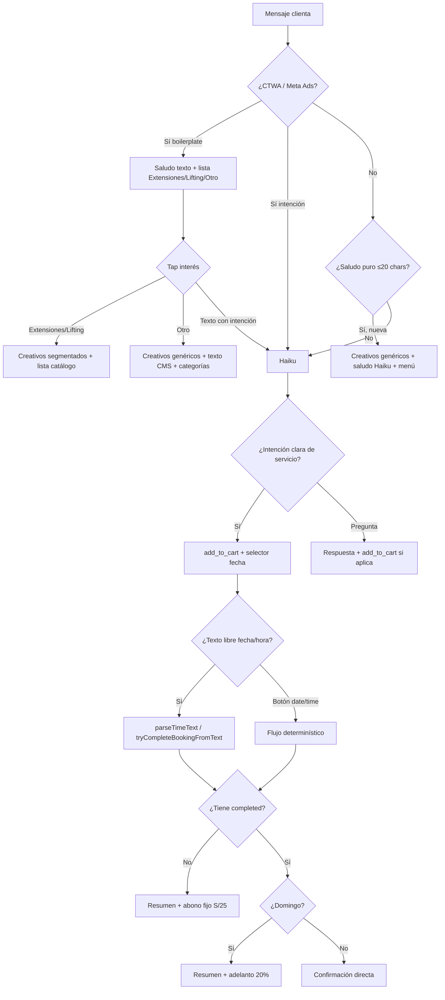

# Directrices WABA — Haiku y bot conversacional

**Proyecto**: ZM Lash & Nails Beauty · v2.3+  
**Objetivo de producto**: que la clienta sienta que escribe con una asesora real del salón — no con un menú de botones. Haiku responde, entiende, arma el carrito y lleva hasta la fecha/hora con la mínima fricción posible.

**Implementación**: `supabase/functions/whatsapp-webhook/`  
**Config editable**: tabla `waba_config` + panel `/panel/waba/campanas`  
**Análisis de calidad**: rutina → [rutina-waba-analysis.md](./rutina-waba-analysis.md) · lecciones [../analysis/LECCIONES.md](../analysis/LECCIONES.md) · [README carpeta](../analysis/README.md)

---

## 1. Principio rector

> **Conversación primero, listas después.**

La clienta debe poder escribir como en un chat normal:

- _"Cuánto está planchado de cejas y lifting?"_
- _"Hay promo por ambas? Quisiera ir hoy"_
- _"Me hice clásicas en otro lugar, quiero cambiar de técnica"_
- _"No es a las 11, es a las 4:45"_

Haiku (Claude Haiku) es la **capa principal de interacción en texto libre**. Las listas interactivas de Meta son **respaldo** para elegir fecha/hora o navegar el catálogo cuando la clienta lo pide explícitamente — no el camino por defecto.

---

## 2. Dos perfiles de llegada

### 2.1 Clienta orgánica o habitual

**Quién es**: escribe directo al WhatsApp del salón, vuelve después de una visita, o llega por referido sin anuncio.

**Señales en BD**: `fromAd = false`, puede tener historial en `clients` / citas `completed`.

**Flujo de bienvenida**:

| Situación                                                                      | Comportamiento                                                                                        |
| ------------------------------------------------------------------------------ | ----------------------------------------------------------------------------------------------------- |
| Clienta **nueva**, saludo puro (≤20 chars: "Hola", "Buenos días")              | **Imágenes de campaña** (`meta_ads_*` en `/panel/waba/campanas`) + saludo Haiku + menú con promos     |
| Clienta **nueva**, mensaje con intención ("precio de lifting", "vi la promo…") | **Imágenes de campaña** primero + **Haiku** (sin segundo saludo de bienvenida; no marca `from_ad_at`) |
| Clienta **recurrente**, saludo                                                 | Menú / retomar carrito abandonado si aplica — **sin** pack de creativos                               |
| Clienta **recurrente**, pregunta o servicio concreto / "voy a llegar tarde"    | **Haiku** / handler de cita — **sin** imágenes de campaña                                             |

Los creativos son las mismas URLs opcionales que CTWA (hasta 4). Si el panel no tiene ninguna URL, el envío es no-op.

**Tono**: español peruano natural, profesional y aspiracional. Ver reglas de tono en `lib/haiku-cms-defaults.ts`.

- **Prohibido**: apodos ("amor/cielo/reina/princesa/babe/baby/guapa"), vocabulario de mimo ("consentirte", "mimar", "acicalar", "malcriarte", "date tu gustito")
- **Preferido**: aspiracional y directo ("lucir espectacular", "pestañas deslumbrantes", "cejas perfectas", "look increíble", "lucir al 100")
- **Bebés / niños**: pueden llevarlos al salón sin problema. Si lo mencionan con duda o como freno / pedida de domicilio → tranquilizar; **prohibido** tratarlo como "complicado" o empujar domicilio (solo salón).
- **Duración del catálogo (minutos)**: es el **tiempo de la cita en el salón** ("la cita toma unos 90 min"). **Prohibido** cotizar con "duran 90 minutos" (suena a que el look se cae a la hora). "¿Cuánto dura?" / "¿Cuánto me dura?" / "¿Cuánto tiempo dura?" → **solo** resultado en el tiempo (días/semanas/meses) + CTA; **no** reañadir minutos de salón en ese turno (Luz …6235). Minutos de cita solo si pregunta explícitamente cuánto tarda la sesión. Si el historial reciente del bot ya dijo los minutos, no repetirlos.
- **Sin reserva activa**: NUNCA confirmar cita, decir "te esperamos" / "¿a qué hora llegas?" / "nos vemos". Si la clienta afirma tener cita o que ya viene, avisar que no encontramos la reserva y ofrecer _agendar_ o el 932.

### 2.2 Clienta desde campaña Meta (Click-to-WhatsApp / CTWA)

**Quién es**: hizo clic en anuncio de Meta. Mensaje típico: _"¡Hola! Quiero más información"_ o copy de campaña (p. ej. Set 2026 _"¡Hola! Quiero despertar con una Mirada Espectacular 💜"_).

**Señales**: payload `referral` en webhook (`source_type: ad`, `ctwa_clid`, o `source_type: post` con clid); o copy conocido sin referral (`isKnownCtwaCampaignCopy` → `from_ad_at`).

**Prefills conocidos (no son menú orgánico)**:

- Set 2026: _«¡Hola! Quiero despertar con una Mirada Espectacular»_ → boilerplate → lista interés.
- **Set-Oct 2026**: _«¡Hola! Quiero saber qué estilo de pestañas me queda mejor»_ → **intención pestañas** (no BP; Haiku mismo turno con mapa Clásicas/Rímel/3D/4D/Lifting, **sin** `show_category`). Bounce: `meta_ads_bounce_nudge_text` (“¿Qué mirada quieres llevar?”).

**Taxonomía extensiones (Haiku-primero — enseñar al modelo, no anular su action)** — `lib/extension-effects-guide.ts`:

1. **Fibra/SKU** (precio propio): Clásicas, Rímel, Mojado, Baby Vol. 3D, 4D, Fox, Anime… — “efecto rímel” = SKU Rímel; “foxy” = Fox.
2. **Diseño/mapeo** (mismo SKU): ojo de gato, ardilla, ojo abierto, muñeca.
3. Fotos / explicación de **fibra** → fichas `edu-fiber-{clasicas|rimel|3d|4d}` (`Extensiones_*.jpeg`: técnica + diseños). Varias fibras → esas fichas + Fox/Anime del portafolio (no volcar solo diseños Rímel — Nicole …5813).
4. “Precios” + “extensiones” → cotizar fibras en texto (`action:none`); evitar laberinto de listas (Jerita …8523). Prompt: sin `show_category` en extensiones salvo que pida el menú.
   - Este caso cubre texto libre. Reincidencia del **mismo cliente vía taps** (navegación por `list_reply.id`, donde Haiku no interviene por diseño) resuelta aparte con `catalog_nav_taps_count` — ver `docs/waba/analysis/LECCIONES.md` § "Fix 18-sep — laberinto de taps de catálogo".

**Flujo de bienvenida** (clienta nueva **o recurrente** con sesión stale / anuncio):

| 1.er mensaje                                                      | Comportamiento                                                                                                                                                                                               |
| ----------------------------------------------------------------- | ------------------------------------------------------------------------------------------------------------------------------------------------------------------------------------------------------------ |
| **Boilerplate** (CTA vacío Meta — `isMetaAdsBoilerplateCta`)      | Texto bienvenida (`¡Hola[, Nombre]! 💜 Bienvenida…`) + lista **¿Qué te interesa hoy?** (Extensiones / Lifting / Uñas / Otro). Step `awaiting_ctwa_interest`. **Sin** imágenes ni dump de menú en este turno. |
| **Intención extra** (precio, servicio, _«quiero agendar…»_, etc.) | Creativos genéricos (si hay URL) + **Haiku** mismo turno. **Sin** pregunta de interés. Si Haiku falla → `meta_ads_services_text` + lista categorías/promos.                                                  |

Tras el tap de interés:

1. **Extensiones** → collages `meta_ads_extensiones_*` + pregunta de look/efecto (**sin** lista subcats)
2. **Lifting** → collage `meta_ads_lifting_*` + pregunta de pack (**sin** lista servicios)
3. **Uñas** → pregunta Soft Gel / PolyGel / Builder / manicure-pedicure (**sin** lista)
4. **Otro** → pregunta de rubro en texto (**sin** lista categorías; **sin** 4 imgs genéricas / sede)
5. Texto libre con intención en `awaiting_ctwa_interest` → Haiku (no re-pide el tap)

**Cierre por efecto concreto (Plan 04)**: si ya dijo ojo de gato / fox / etc. → cotizar con `S/…` + collage/CTA; **no** `show_category` del mismo rubro en ese turno. «Precio» solo **sin** rubro = pedir categoría o varios montos; nunca “te paso precios” sin cifras. Si ya dijo **extensiones** (o Set-Oct): cotizar **fibras** en líneas con S/ del catálogo (`action:none`) — Haiku-primero; no abrir subcats/packs de entrada.

**Objetivo comercial**: la pauta ya mostró creativo; el bot **segmenta** por interés en vez de mandar 4 imágenes genéricas a ciegas. Haiku explica efectos (ardilla, ojo de gato, mojado y los nombres del catálogo **Anime, Hawaiana, Mega Volumen, Fox y Wispy Glam** — ver `lib/extension-effects-guide.ts`), recomienda y cierra con `add_to_cart` cuando confirme. Máximo 2 burbujas cortas; solo ampliar con medidas o fibras si la clienta lo solicita. Cierre informativo: **pregunta antes del carrito** (`.cursor/rules/haiku-bot-cierre-pregunta.mdc`).

**Panel**: `/panel/waba/campanas` — creativos genéricos + Extensiones 1–2 + Lifting 1–2 + copy bounce + **guías edu** (`edu_pelo_a_pelo_*`, `edu_fiber_*`, `edu_mapping_*`). QA: `yarn waba:validate:ctwa-interest` · `yarn waba:validate:edu-guides` · `yarn waba:validate:lash-fibers`.

**Guías educativas (15-sep)**:
| Intent | Imagen | Acción |
|--------|--------|--------|
| pelo a pelo / 1:1 | `edu-pelo-a-pelo` | `show_edu_guide:pelo_a_pelo` |
| fotos/explicación Clásicas·Rímel·3D·4D | `edu-fiber-*` (fichas Extensiones*\*) | `show_edu_guide:fiber*_`|
| “mapping/mapeo” explícito |`edu-mapping-_`|`show*edu_guide:mapping*\*`|
| Mojado (sin ficha Extensiones_) |`edu-mapping-mojado`|`mapping_mojado` |

No sustituyen collages CTWA. Portafolio = ojos reales (Fox/Anime/etc. sin ficha edu).

**Bounce de un solo toque** (métrica de producto, no bug): muchas CTWA abren y no mandan 2.º mensaje; reenganche vía `ads-bounce-nudge` (9–22 Lima). La lista de interés **sí** es el 1.er turno intencional — no confundir con el menú completo de categorías. Tras desplegar `awaiting_ctwa_interest` (PR #58–#61), la ventana 25-ago midió **25%** bounce (5/20) vs 39–62% con el flujo de 4 imágenes genéricas.

### 2.3 Venta emocional CTWA (v1 — Extensiones / Lifting)

**Motivación**: caso MORELIAMM — el bot llegó a `awaiting_datetime` pero solo reenvió copy operativo; la conversión emocional (imagen + halago) la hizo staff manual. v1 automatiza el momento **casi cierra** para leads con `from_ad_at` y carrito 100 % `cat-extensiones` o `cat-lifting`.

| Capa                      | Qué hace                                                                                                                                    |
| ------------------------- | ------------------------------------------------------------------------------------------------------------------------------------------- |
| **Haiku**                 | Bloque dinámico `haiku_emotional_selling_ctwa_ext_lift` si `from_ad_at` — metáfora suave (valoración, invertir en ti), sin rol de psicóloga |
| **cart-nudge nudge1**     | En `awaiting_datetime`: imagen (portafolio → collage CTWA) + frase CMS rotativa + calendario                                                |
| **cart-nudge nudge2**     | Copy suave CMS (`emotional_nudge2_reply_ctwa`), sin urgencia fría                                                                           |
| **Decline**               | _"Voy a pensarlo…"_ → `emotional_decline_reply_ctwa` + vaciar carrito                                                                       |
| **Foto proactiva precio** | Caption cálido `emotional_price_cta_ext` (CTWA + extensiones)                                                                               |

**CMS**: `/panel/waba/campanas` → sección _Venta emocional CTWA (v1)_. Placeholders: `{servicio}`, `{parte}`.

**Imágenes**: prioridad portafolio del servicio en carrito; si no hay (ej. Anime sin fotos), fallback collage segmentado del panel.

**QA**: `yarn waba:validate:emotional-ctwa` (unit, sin webhook).

**Métrica % carrito → fecha elegida (18-sep-2026)**: `wa_messages.nudge_variant` (`'emotional'|'generic'`, migración `add_wa_messages_nudge_variant`) registra qué variante recibió cada nudge de `cart-nudge`. Reporte: `scripts/db/query-emotional-nudge-conversion.sql` (cruza contra `appointments.whatsapp_phone`, ventana 24h). Solo cubre nudges enviados después de este deploy — sin dato histórico previo. Correr este reporte con volumen suficiente (días/semanas) antes de decidir la siguiente expansión.

**Expansión planificada (post-métrica)** — no está en v1:

- Uñas, depilación, orgánico sin `from_ad_at`
- Nudge emocional en `browsing` sin calendario
- Mensajes con bot pausado (`bot_paused_at`)
- A/B de frases (una vez que la métrica confirme que v1 convierte)

Código: `lib/emotional-selling.ts`, migración `add_emotional_selling_ctwa`.

---

## 3. Qué hace Haiku vs qué hace el flujo determinístico

### Haiku SÍ (texto libre, step `browsing` y — objetivo — pasos activos con preguntas)

| Acción                                                   | Descripción                                                    |
| -------------------------------------------------------- | -------------------------------------------------------------- |
| Responder precios, duración, diferencias entre servicios | Solo precios del catálogo en BD                                |
| Recomendar según historial o "primera vez"               | Máximo 2 opciones relevantes, no listas largas                 |
| Resolver dudas (cuidados, contraindicaciones, embarazo)  | Derivar a especialista si es médico                            |
| **`add_to_cart`**                                        | Identificar servicio(s) y llenar carrito en el **mismo turno** |
| **`add_to_cart` + abrir fecha**                          | Tras confirmar servicios, pasar a selector de día              |
| Responder promo/pack cuando preguntan en conversación    | Buscar en `promotions` / `promotion_items` / `packs`           |

### Haiku NO (siempre determinístico)

| Caso                                                                   | Handler                                                                                         |
| ---------------------------------------------------------------------- | ----------------------------------------------------------------------------------------------- |
| IDs interactivos (`cat-`, `svc-`, `pack_`, `promo_`, `date_`, `time_`) | dispatcher                                                                                      |
| Subida de foto previa / screenshot de pago                             | steps.ts                                                                                        |
| **Foto de diseño mid-funnel** (efectos que cambian precio/tiempo)      | `inbound-image.ts` → pausa staff (`bot_paused_at`); **no** Haiku hasta Reactivar / Haiku agenda |
| Confirmación final de slot con botón `time_`                           | agenda + payment                                                                                |
| Notificaciones push / FCM al staff                                     | notify.ts                                                                                       |

**Foto diseño (producto, ago 2026)**: si la clienta manda imagen y no es comprobante ni referencia de cita ya `scheduled`, el bot **se pausa**. Ack 7 AM–9 PM Lima (“asesora… tras visualizar diseño”) / fuera de horario. Staff cotiza en panel; push si la clienta escribe en pausa. Botones **Reactivar bot** / **Haiku agenda** (`waba-staff-session`). Con cita `scheduled`, sigue el flujo de referencia visual (Agenda).

### Regla de oro — pregunta antes del carrito, luego `add_to_cart`

**Siempre** terminar el turno informativo con una **pregunta** antes de entrar al flujo carrito
(listas de catálogo como único cierre, `add_to_cart`, selector fecha). Haiku-primero: enseñar
al modelo; no inventar guards que anulen su `action`.

| Fase                 | Qué hace Haiku                                                                               |
| -------------------- | -------------------------------------------------------------------------------------------- |
| 1 — Informa / cotiza | Precio(s) del catálogo + **pregunta** (`¿Cuál te gusta?` / `¿Te lo agendo?`). `action:none`  |
| 2 — Confirmó         | `sí` / `dale` / `ese` / `agéndame` / nombre elegido → `add_to_cart:UUID` (+ fecha si aplica) |

```xml
<!-- Turno 1 — aún no confirmó -->
<text>Clásicas S/70 · Rímel S/85 · Baby Vol. 3D S/100. ¿Cuál te llama más? 💜</text>
<action>none</action>

<!-- Turno 2 — ya confirmó -->
<text>¡Listo! Te agendo Extensiones Rímel 💜</text>
<action>add_to_cart:UUID-DEL-SERVICIO</action>
```

**Prohibido**: cerrar sin pregunta y abrir subcats/packs; decir _"Escribe agendar"_ con `<action>none</action>` (loop carrito vacío → menú).

Excepción: si el **mismo** mensaje de la clienta ya trae confirmación inequívoca
(“agéndame el lifting”, “quiero el 3D”), se puede `add_to_cart` en ese turno.

Fuente de verdad: `lib/haiku-prompt.ts` (`FORMAT_INSTRUCTION`) · regla agente
`.cursor/rules/haiku-bot-cierre-pregunta.mdc`.

### Formato de listas de precios (viñetas)

Cuando Haiku cotiza **2+ servicios** con precio:

- **1 viñeta por línea** (`🌸` o `⭐`), con salto de línea real — nunca varios ítems en el mismo renglón.
- El saludo / "Srta. …" va **antes** o en burbuja aparte; no pegado a la primera viñeta en la misma línea.
- Red de seguridad en código: `forceBulletLineBreaks` dentro de `sanitizeHaikuText` (`ai-assistant.ts`)
  inserta `\n` si detecta 2+ viñetas + 2+ `S/` sin saltos. El honorífico (`addressWithoutHello`) **no**
  debe colapsar esos `\n` a espacios.
- QA: `yarn waba:validate:price-list-bullets`.

### Confirmación de pack / oferta cotizada

Si Haiku cotizó un pack (o servicio) con `action:none` y la clienta confirma ("sí el pack", "me gusta
ese", "dale"), el cierre es `add_to_cart` (pending CTA / IDs del turno) — **no** abrir Categorías ni
`show_packs` por la sola palabra "pack". QA: `yarn waba:validate:pack-confirm`.

**Oferta condicional de portafolio** (PR #137): si Haiku dice en texto que puede mostrar fotos
reales / ejemplos (`action:none`, sin `show_portfolio`), se setea `pending_portfolio_cta_at`. Un
"Sii"/"Si" corto (≤3 chars, que Haiku no ve) abre el portafolio vía `tryAcceptPendingPortfolioCta`
— mismo patrón que `pending_price_cta`. La detección exige **invitación** (`si quieres` /
`te puedo mostrar`), no solo mencionar "fotos reales".

---

## 4. Cómo debe sentirse la conversación (estándar de calidad)

Referencia: una conversación exitosa tipo Angie (inicio 2-jun-2026):

```
Clienta: Cuánto está planchado de cejas y lifting?
Bot:     Precios S/50 c/u + add_to_cart ambos + selector de fecha
```

**Checklist por turno**:

1. **Una respuesta útil** — no menú + Haiku en el mismo turno
2. **Estilo Vanessa** — hasta **4 burbujas** cortas (precios sueltos → pack → incluye → CTA); no un párrafo corrido
3. **Emojis** de marca (💜 🌸 🌷 💅) — 1 por burbuja está bien
4. **Precio real** del catálogo — nunca inventar ni calcular %; pack: **full + promo tabulado** si el ítem está en PROMOCIONES ACTIVAS (ej. Rubber+Pies full S/105 → promo S/98 Lun–Mié)
5. **Ubicación** — dirección + link Maps (`maps.app.goo.gl/…`) siempre que pregunten dónde quedan. Si mencionan Parque Kennedy / Av. Amistad: aclarar **no estamos en Miraflores** → Surco / Benavides / Plazuelas + Maps (`resolveUbicacionReply`). Tras enviar Maps, **no** dejar que Haiku repita la dirección.
6. **Identidad post-cita (BSUID)** — nombre+DNI se guarda por `wa_user_id` si no hay teléfono (LION / Meta usernames). No decir «No pude guardar» si la ficha existe por BSUID.
7. **Siguiente paso claro** — carrito lleno → fecha; fecha elegida → hora; hora → **sin `completed`**: resumen + abono S/25; **domingo + historial**: adelanto 20 %; **L–S/feriado + historial**: confirmación directa
8. **Multi-cita / terceros** — hasta **2** citas `scheduled` por chat (juntas o solo para otra persona). «Somos 2» / «para mi hija» puro → el bot abre party (`isMostlyPartyIntent`); si mezclan precio/promo → Haiku primero (`action:none`, sin inventar promo). Con 2 citas ya programadas → orientar al *932 535 512*. **No** digas «solo una cita a la vez».
9. **Sin silencio** — si el mensaje no es eco de Meta, siempre hay respuesta

**Anti-patrones** (detectados en análisis 31-may / 01-jun / 02-jun / 03-jun / ago-2026):

| Anti-patrón                                                                       | Efecto en clienta                                                                                                                            |
| --------------------------------------------------------------------------------- | -------------------------------------------------------------------------------------------------------------------------------------------- |
| CTA "agendar" sin carrito                                                         | Loop infinito, staff interviene                                                                                                              |
| Menú genérico tras pregunta concreta                                              | Sensación de "no me leyeron"                                                                                                                 |
| "Usa los botones" cuando preguntó promo                                           | Abandono (caso Angie)                                                                                                                        |
| Segundo saludo de bienvenida en mismo hilo                                        | Ruido, desconfianza                                                                                                                          |
| Ignorar corrección de hora con cita existente                                     | Staff manual (caso Keissy)                                                                                                                   |
| Haiku responde precio sin mostrar lista de categoría                              | Staff manual para ofrecer lista (caso 5267)                                                                                                  |
| Vocabulario de "consentir/mimar" en saludos                                       | Tono cursi, percepción de bot genérico                                                                                                       |
| **Promos genéricas** cuando pidió promos **de un rubro** (uñas, pedicure…)        | Laberinto de listas; pierde promo relevante (caso Alejandra …618163, jul-2026)                                                               |
| **"¿Qué deseas hacer?"** tras elegir servicio                                     | No empuja a agendar; fricción extra (→ carrito → calendario directo)                                                                         |
| **"Ver Servicios"** en lista de promos                                            | Deriva al catálogo completo cuando ya estaba en flujo promo                                                                                  |
| **Precio sin aclarar** (pregunta concreta, respuesta vaga o sin total)            | Staff manual / abandono (caso Eli …1033, ago-2026) — el auditor `chat-quality-review` avisa “Revisar YA”; Haiku debe precio + siguiente paso |
| **Carrito ≠ lo pedido** (pack + servicio de más, o ítem distinto al creativo/CTA) | Confusión y rework (caso Yoja …9827) — un solo carrito coherente; no duplicar                                                                |
| **Promo mencionada e ignorada** (ej. % en el mismo hilo)                          | Clienta siente que no leyeron (Yoja) — aplicar o explicar por qué no aplica                                                                  |
| **Texto corrido** con precios+promo+incluye en un solo bloque                     | Difícil de leer (Eli); cotizar estilo Vanessa en burbujas                                                                                    |
| **"Solo una cita a la vez" / escalar 932 ante «somos 2»**              | Producto sep-2026: party in-bot (tope 2); no inventar bloqueo de terceros                                                                 |
| **Revisar YA** en CTWA temprano (solo welcome, sin 2.º msg)                       | Ruido staff (Karla); lo cubre ads-bounce                                                                                                     |

---

## 5. Flujo de agendado ideal (Haiku-first)



**Listas interactivas** solo cuando:

- Haiku dispara selector de fecha/hora tras `add_to_cart`
- Clienta pide explícitamente "ver servicios", "menú", "promos"
- Haiku no puede resolver en 2 turnos → fallback suave, no menú frío

La lista de **horas** pagina igual que servicios y packs: si no caben en 10 filas, la primera página cierra con `▶ Ver más horarios` (el texto de esa fila dice el rango que sigue, por ejemplo 2:00 PM a 5:30 PM) y la siguiente trae `◀ Anteriores`. No se descartan horarios para hacerlas caber. Escribir `5` o `5:30` sigue agendando aunque esa fila esté en la otra página.

---

## 6. Clientas con cita existente (Mi cita)

Si `getPendingAppointmentsForPhone` > 0, mensajes sobre **su cita ya agendada** deben ir al flujo **Mi cita**, no a bienvenida genérica:

- "reprogramar", "mi cita", "había pedido", "cambiar hora"
- **Ampliar detección** (pendiente de implementar): "no es a las X", "coordine para", "es a las 4:45"

Comportamiento esperado:

1. Mostrar resumen de cita(s) pendiente(s)
2. Ofrecer reprogramar (UPDATE `appointments.date`, sin duplicar fila)
3. Haiku puede aclarar, pero **no** enviar menú de bienvenida encima

Archivo: `handlers/pending-appointment.ts`

### Dinero de una reserva ya pagada

Pedir la plata de vuelta («cancelar y recuperar mi adelanto», «quiero mi dinero», «ya no puedo ir») no es una pregunta de catálogo:

- **Política única:** el adelanto no es reembolsable cuando la cancelación es de la clienta (con o sin aviso, imprevisto, «no tengo plata», pago reciente). Solo se puede reprogramar **una sola vez**, con aviso de mínimo 24 h antes de la cita y sujeto a disponibilidad; el adelanto se mantiene a favor de la clienta. No decir «voy a consultar».
- **Única salvedad (falla del salón):** si el salón canceló, no pudo atender o no prestó el servicio, Haiku NO aplica la política ni promete nada: avisa que una persona del equipo le escribe y emite `action:escalate_staff:salon_fault` (push distinto al staff; corresponde reprogramar sin costo o reembolsar). Una negativa absoluta sin excepciones es el patrón que Indecopi sanciona (Manzana Verde, 7 UIT, RE1788-2025-SPC).
- **Vocabulario:** Haiku NUNCA escribe «devolución», «devolver», «reembolso» ni «reintegro» (sí «no es reembolsable»). Prohibido prometer, insinuar, gestionar o tramitar que el dinero vuelve, y prohibido mandarla a otro número.
- **Guardia en código:** `containsRefundPromise` (`lib/staff-escalation.ts`) revisa las burbujas en `handleAIMessage`; si hay lenguaje de devolución las reemplaza por `buildRefundFallbackMessage` (con `escalate_staff`) o `buildRefundPolicyOnlyMessage` (consulta informativa).
- Cierra avisando que una persona del equipo le escribe por este chat. `action:escalate_staff:refund` (pausa + push).
- El regex `matchesRefundIntent` corre antes y hace lo mismo si coincide. Si Haiku no responde, sale el texto fijo de `buildRefundFallbackMessage`.
- Pregunta de regla antes de pagar («¿el adelanto se devuelve?», «¿el adelanto de S/25 se devuelve?», «si cancelo, ¿se devuelve?») → política y `action:none`. No pausa el bot.
- Cancelar sin hablar de plata sigue en Mi cita.

Archivo: `lib/staff-escalation.ts`, caso en `lib/haiku-prompt.ts`.

---

## 7. Pasos activos — comportamiento deseado (gaps conocios)

Hoy el dispatcher es **rígido** en `awaiting_datetime` / pago: texto que no parsea como fecha/hora recibe _"Para elegir la hora, usa los botones"_.

**Directriz de producto** (a implementar):

| Step activo         | Clienta escribe                                | Respuesta esperada                                            |
| ------------------- | ---------------------------------------------- | ------------------------------------------------------------- |
| `awaiting_datetime` | "Hay promo?", "cuánto por ambas", "quiero hoy" | Haiku responde promo/precio; puede ajustar carrito            |
| `awaiting_datetime` | "10 am", "hoy 4 de la tarde"                   | Parser de hora / completar booking                            |
| `awaiting_datetime` | "me equivoqué, era rimel no clásicas"          | Corrección de carrito → Haiku o `matchesCartCorrectionIntent` |
| Cualquier step      | Pregunta médica / ubicación / horarios         | Haiku breve + retomar step                                    |

---

## 8. Rate limit y fallback

- **40 mensajes inbound / hora** por número → mensaje amable + menú (evitar abuso/costos Haiku)
- Si Haiku timeout (5 s) o API falla en trigger **`fallback`** (texto libre sin match de keyword `free_question`/`recommendation`, ej. "¿atienden podología?") → **un** mensaje remitiendo al número del equipo `STAFF_COORDINATION_PHONE` (932 535 512) — **no** cae en el menú genérico de promos, que no responde la duda (`dispatcher.ts` fix jul-03, fuera del rango del catálogo)
- Si Haiku timeout/falla en trigger `free_question`/`recommendation` (keyword reconocida, más probable que esté en catálogo) → sigue cayendo en menú genérico (comportamiento previo, evita saturar al equipo con preguntas que probablemente el bot sí puede resolver)

---

## 9. Idioma y clientas internacionales

Prefijos fuera de `SPANISH_ONLY_CODES`: Haiku responde **bilingüe** (español + idioma del país del prefijo). Citas pendientes se incluyen en contexto de sistema.

---

## 10. Después del abono / comprobante

**Depósito en WABA** (`kind=deposit`): abono fijo S/25 (sin `completed`) o 20% domingo (con historial) → clienta envía comprobante → `processPaymentScreenshot` → plantilla `pago_recibido_validar_zm` a Vanessa + fila en Validación de pagos.

**Comprobante fuera de flujo** (`post_service_payment`): Haiku Vision clasifica la imagen; si es pago → misma plantilla; aprobar **no** reenvía políticas de cita (solo ack de pago recibido).

**Tras aprobación** (app o botón WA de Vanessa):

1. Staff aprueba (`deposit`) → confirmación, políticas, consideraciones, imagen Tardanzas
2. Staff aprueba (`post_service_payment`) → mensaje corto de pago recibido
3. En `deposit`, cita queda / se confirma `scheduled`

Detalle técnico: [EDGE_FUNCTIONS.md](../EDGE_FUNCTIONS.md) § Clasificación de imágenes + plantilla `pago_recibido_validar_zm`.

---

## 11. Métricas de éxito

| Métrica                                                | Objetivo           |
| ------------------------------------------------------ | ------------------ |
| Citas cerradas solo por bot (sin staff manual en hilo) | ↑ mes a mes        |
| Mensajes inbound promedio hasta cita                   | ↓ (menos fricción) |
| Hilos con STAFF_TAKEOVER en análisis 48 h              | ↓                  |
| Reincidencias P1/P3 en reportes consecutivos           | 0                  |
| Clientas CTWA que reciben flujo fromAd                 | 100 %              |

---

## 12. Archivos de referencia (código)

| Archivo                           | Rol                                                    |
| --------------------------------- | ------------------------------------------------------ |
| `handlers/dispatcher.ts`          | Orquestador: saludo, CTWA, steps, echo filter, Mi cita |
| `handlers/ai-assistant.ts`        | Haiku: trigger, parse XML, acciones                    |
| `lib/haiku-prompt.ts`             | System prompt, catálogo, FORMAT_INSTRUCTION            |
| `lib/haiku-greeting.ts`           | Saludos personalizados por franja horaria              |
| `lib/haiku-cms-defaults.ts`       | Defaults + tono (editable vía waba_config)             |
| `handlers/pending-appointment.ts` | Citas existentes, reprogramación                       |
| `lib/staff-escalation.ts`         | Devolución: pausa + push; regex de respaldo           |
| `handlers/agenda.ts`              | Selectores fecha/hora                                  |
| `handlers/payment.ts`             | Resumen, screenshot, verificación                      |
| `lib/inbound-image.ts`            | Foto diseño → Storage + pausa staff + ack horario      |
| `handlers/staff-resume.ts`        | Panel: resume_bot / haiku_finish_booking               |
| `waba-staff-session/` (Edge)      | API panel para reactivar bot o Haiku agenda            |

---

## 13. Productos retail (kit — no es cita)

**Kit cuidado pestañas ZM (S/16)** — FAQ en Haiku; venta/apartado lo hace Vanessa en `/panel/productos`.

| Señal | Comportamiento |
| ----- | -------------- |
| “qué es el kit”, shampoo, peine, cepillo limpiador, “cómo se usa” | Explicar en ≤3 líneas + pregunta. `action:none`. **Prohibido** `add_to_cart` / `show_category` |
| “sí” / apartar / comprar el kit | Confirmar, preguntar retiro en salón vs Yape, derivar a Vanessa **932 535 512**. No inventar cita ni pago |
| Quiere **agendar** un servicio además | Ahí sí flujo normal de cita (pregunta → confirmación → carrito) |

Código: CASO en `FORMAT_INSTRUCTION` (`haiku-prompt.ts`); bloque **PRODUCTOS RETAIL** en `waba_config.haiku_system_prompt` (BD override) + `haiku-cms-defaults.ts`. Contrato + port Geema: [`08-PLAN-retail-productos.md`](../../plans/geema-migration/08-PLAN-retail-productos.md).

---

## 14. Promos masivas (distinto del bot 1:1)

Campañas outbound con plantilla `promo_zm_v1` → Edge Function `send-promo-whatsapp`, pantalla `PromoMasivaScreen`. **No confundir** con el flujo conversacional Haiku.

Documentación: [EDGE_FUNCTIONS.md](../EDGE_FUNCTIONS.md), implementación ya en producción (v1.8+).

---

_Última actualización: sep 2026 — v3.1: viñetas 1/línea + `forceBulletLineBreaks`; confirm pack → carrito;
excepción Haiku mid-boleta; Plan 08 Fase 1 / Haiku-primero B4. Previo v2.9: fallback STAFF_COORDINATION_PHONE
en trigger `fallback`. Previo v2.5: show_category free_question/fallback, FORMAT_INSTRUCTION 2 pasos,
vocabulario aspiracional, identidad staff. Casos: Angie/Keissy 02-jun, 5267 03-jun, Noelia 03-jul,
Gimena/Alberto VE 17-sep._
