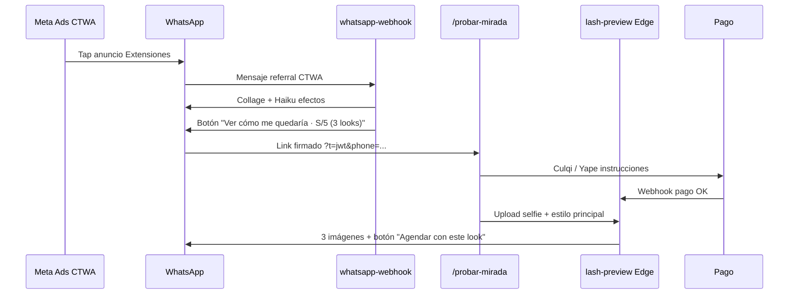

# Plan 06 — Preview virtual de extensiones (CTWA monetización)

> **Producto multi-categoría y naming → [Plan 07 — Look Preview](./07-PLAN-look-preview-multi-servicio.md).**  
> Este Plan 06 queda como **historial del spike** (overlay MediaPipe NO-GO + Vertex Gemini GO) y del piloto **Extensiones** (Avril). Fases de producto (Culqi, `/probar-mirada`, catálogo multi-servicio, renombre `look-preview`) viven en Plan 07.
>
> Documento de contexto técnico del spike. **Piloto en ZM Lash & Nails**; diseño **tenant-ready** para **GeemaStudio**.
>
> Súbelo a project knowledge de **ZM Lash & Nails** y de **GeemaStudio** (zm-tech).

**Última actualización:** 2026-09-02  
**Autor del plan:** Alberto Orta (Founder & CTO, ZM Tech)  
**Estado general:** **Fase 0 bis GO** (cerrado como spike) — Vertex Gemini Image validado (Avril); Edge scaffold aún llamado `lash-preview` → renombre a `look-preview` en Plan 07. Producto MVP → Plan 07.

---

## 1. Qué problema resuelve esto

### Contexto comercial

ZM invierte **S/2–3 por chat iniciado** en Meta Ads (CTWA). Una fracción importante de esas clientas:

- Toca el anuncio, entra por WhatsApp, pregunta por **Anime / Fox / Wispy / efectos**.
- Recibe collages + explicación Haiku (Plan 04).
- **No agenda** — el hilo muere sin ingreso.

Hoy ese costo de adquisición **no se recupera** si no hay cita. El preview virtual convierte parte de ese tráfico en **micro-ingreso directo** y, en el mejor caso, en **cita** con estilo ya elegido.

### Hipótesis de producto

| Métrica objetivo | Meta piloto (90 días) |
|---|---|
| % chats CTWA Extensiones que pagan preview | ≥ 15 % |
| Ingreso bruto preview / chat CTWA (blended) | ≥ S/0,80 (cubre ~⅓ del CPA) |
| Preview pagado → `add_to_cart` en 7 días | ≥ 25 % |
| Tiempo entrega post-pago | ≤ 2 min (p95) |

### Modelo de precios (pay-first, sin preview gratis ni watermark)

| Paquete | Precio | Contenido |
|---|---|---|
| **Pack inicial** | **S/5** | 1 look elegido + **2 looks extra gratis** (3 imágenes total) |
| **Pack ampliación** | **S/8** | **2 imágenes más** (otros estilos o re-generación con otra selfie) |

**Reglas de producto:**

- **Cobro antes** de procesar la selfie — no hay imagen de resultado sin pago confirmado.
- Antes del pago sí se muestran **ejemplos del portafolio** (fotos reales del salón, no la cara de la clienta).
- Copy legal: *preview orientativo; el resultado en salón puede variar según anatomía del ojo y técnica de la especialista*.
- Los 2 looks “gratis” del pack S/5 son **retención en el hilo** y upsell a agendar — no un regalo independiente del pack.

---

## 2. Qué NO es este producto

| Descartado | Motivo |
|---|---|
| Leer notificaciones push de Yape | Fuera de scope; políticas Android; no aporta al preview |
| Preview con marca de agua / freemium | Decisión de producto: pay-first |
| **Lifting** en v1 automático | Prioridad extensiones + looks combinados vía prompt; lifting solo si QA staff OK |
| Overlay MediaPipe + PNG | Spike Fase 0 **NO-GO** — descartado |
| Haiku “pintando” la imagen | Haiku **no edita píxeles** — solo clasifica, valida y recomienda estilo |
| Widget embebido dentro de WhatsApp | WA solo admite texto, botones, listas e imágenes — no iframe ni componente web |
| Garantía de resultado idéntico al preview | Producto de inspiración comercial, no contrato de servicio |

---

## 3. Enfoque técnico (v1) — Vertex Gemini Image

### Pipeline de render (decisión 01-sep-2026)

```
Selfie (post-pago o piloto staff)
  → Haiku Vision: ¿rostro con ojos visibles? ¿calidad OK?
  → Vertex AI gemini-2.5-flash-image @ us-central1
      · selfie + prompt estilo (semantic inpainting)
      · opcional: foto portafolio como referencia visual
  → PNG/JPEG resultado → Storage → envío por WA + link descarga web
```

| Capa | Herramienta | Rol |
|---|---|---|
| **Validación entrada** | Haiku Vision | Rechazar comprobantes, memes, espaldas, ojos tapados |
| **Render** | **Vertex Gemini Image** (`generateContent`) | Edición conversacional — solo zona pestañas vía prompt |
| **Auth GCP** | Service account `supabase-vertex-ai` | JWT → OAuth; secret `GCP_SERVICE_ACCOUNT_BASE64` en Edge |
| **Recomendación estilos 2 y 3** | Haiku + catálogo | Según forma de ojo / intención CTWA / historial sesión |
| **MediaPipe / overlay PNG** | Archivo (Fase 0) | **No usar en prod** — ver SPIKE-CONCLUSIONS |

**Runbook ops:** [`docs/ops/VERTEX_AI_LASH_PREVIEW.md`](../ops/VERTEX_AI_LASH_PREVIEW.md)

### Prompt base (semantic masking)

El modelo no recibe máscara pixel; el prompt acota la edición:

> *Using the provided selfie, change ONLY the eyelash extensions to [estilo]. Keep everything else exactly the same: skin, eyes, eyebrows, makeup, lighting, background.*

Estilos piloto: `Anime`, `Fox`, `Rimel diseño muñeca`, `Lifting + Microblading` (combinados vía copy).

### Referencia portafolio (opcional)

Segunda imagen en `generateContent` — foto real de `/panel/waba/portafolio` para anclar el look del salón.

### Piloto validado — Avril (01-sep-2026)

| Campo | Detalle |
|-------|---------|
| Teléfono | `51946235797` |
| Entrada | CTWA "Mirada Espectacular" |
| Prueba manual | Gemini chat (staff) → imágenes por WA (sin S/5) |
| Spike Vertex | 1.ª imagen automática `Rimel diseño muñeca` — **GO calidad** |
| Comando | `yarn lash-preview:vertex …/avril-selfie.jpg "Rimel diseño muñeca"` |

### Lifting / microblading / cejas

Mismo motor Vertex con prompts distintos — **no** requiere overlay. QA staff antes de prometer en producto pay-first.

---

## 4. Flujos de usuario

### 4.1 Entrada desde CTWA (camino principal)



### 4.2 Todo en WhatsApp (camino alternativo)

1. Clienta ya pagó (comprobante Yape + flujo depósito existente **o** botón que confirma pago Culqi).
2. Bot pasa a step `awaiting_lash_preview_selfie`.
3. Clienta envía selfie por WA → misma Edge `lash-preview` → responde imágenes por WA.

**Recomendación piloto:** camino **4.1 (web)** para cámara, recorte y UX de estilos; camino 4.2 como fallback si no abre el link en 15 min.

### 4.3 Upsell S/8

Tras entregar pack S/5, bot ofrece: *"¿Quieres 2 looks más por S/8?"* → mismo flujo de pago → +2 créditos en `lash_preview_orders`.

---

## 5. Arquitectura de sistema

### 5.1 Componentes nuevos

| Componente | Repo piloto | Repo Geema (destino) |
|---|---|---|
| Página pública `/probar-mirada` | `apps/web` (ZM) | `apps/geemastudio-web` (ruta tenant: `/t/{slug}/preview` o subdominio) |
| Edge `lash-preview` | `supabase/functions/lash-preview` | Mismo motor; `tenant_id` en contexto |
| Edge `lash-preview-payment` (opcional) | Webhook Culqi / confirmación manual | `geemastudio-server` o Edge unificada |
| Tablas BD | ver §6 | Mismas tablas con `tenant_id` |
| Assets overlays | ~~Storage lash-overlays~~ | Referencia portafolio en prompt (opcional); sin biblioteca PNG obligatoria |
| Panel admin | `/panel/waba/preview` (config precios, ON/OFF, métricas) | Módulo Geema L2 |

### 5.2 Integración WABA existente

| Archivo / módulo actual | Cambio |
|---|---|
| `handlers/dispatcher.ts` | CTA post-collage Extensiones → botón preview (si feature flag ON) |
| `lib/haiku-prompt.ts` | No mezclar con booking; CTA preview es acción determinística, no Haiku |
| `lib/emotional-selling.ts` | Variante copy: "mira cómo te quedaría" → link preview |
| `lib/inbound-image.ts` | **No** confundir selfie de preview con `diseno_referencia` / pausa staff — gate por `step` |
| `whatsapp_sessions.step` | Nuevos: `lash_preview_awaiting_payment`, `lash_preview_awaiting_selfie`, `lash_preview_delivered` |
| Portafolio | Fuente de referencia marketing + assets |

### 5.3 Feature flag

`waba_config` key `lash_preview_enabled` (por `tenant_id`) — permite apagar en prod sin deploy.

---

## 6. Modelo de datos (borrador)

```sql
-- Paquetes y créditos por teléfono/sesión
CREATE TABLE lash_preview_orders (
  id uuid PRIMARY KEY DEFAULT gen_random_uuid(),
  tenant_id text NOT NULL REFERENCES tenants(id),
  phone text NOT NULL,
  client_id uuid REFERENCES clients(id),
  pack text NOT NULL CHECK (pack IN ('initial_s5', 'extra_s8')),
  credits_total int NOT NULL,
  credits_used int NOT NULL DEFAULT 0,
  amount_pen numeric(10,2) NOT NULL,
  payment_status text NOT NULL DEFAULT 'pending'
    CHECK (payment_status IN ('pending', 'paid', 'failed', 'refunded')),
  payment_ref text,
  paid_at timestamptz,
  created_at timestamptz NOT NULL DEFAULT now()
);

-- Cada imagen generada
CREATE TABLE lash_preview_results (
  id uuid PRIMARY KEY DEFAULT gen_random_uuid(),
  tenant_id text NOT NULL,
  order_id uuid NOT NULL REFERENCES lash_preview_orders(id),
  style_service_id text NOT NULL,  -- ej. servicio Anime del catálogo
  source_storage_path text NOT NULL,
  result_storage_path text NOT NULL,
  haiku_validation jsonb,
  vertex_meta jsonb,  -- model, location, latency_ms, prompt_hash
  latency_ms int,
  created_at timestamptz NOT NULL DEFAULT now()
);

-- Opcional v2: catálogo de prompts/estilos por tenant (sustituye lash_overlay_assets)
CREATE TABLE lash_preview_styles (
  id uuid PRIMARY KEY DEFAULT gen_random_uuid(),
  tenant_id text NOT NULL,
  style_key text NOT NULL,  -- anime | fox | rimel_muneca | lifting_micro
  display_name text NOT NULL,
  prompt_template text NOT NULL,
  portfolio_image_path text,
  is_active boolean NOT NULL DEFAULT true,
  UNIQUE (tenant_id, style_key)
);
```

~~`lash_overlay_assets`~~ — descartado con pivot Vertex (Fase 0 overlay NO-GO).

```sql
-- DEPRECATED — no crear en prod
-- CREATE TABLE lash_overlay_assets ( ... );
```

**RLS:** mismas reglas que `waba_config` — staff del tenant lee; service_role escribe desde Edge.

**Retención:** job mensual borra selfies + resultados > 30 días si no hay cita vinculada (configurable por tenant).

---

## 7. Pagos (Perú)

Detalle de producto (Culqi primario, Yape puente) → **[Plan 07](./07-PLAN-look-preview-multi-servicio.md)**. Resumen histórico del spike:

| Método | Nota spike |
|---|---|
| **Culqi** | Camino recomendado desde el inicio; confirmado con Vanessa → Plan 07 |
| **Yape manual + comprobante** | Legacy Vision OCR; no escalar a N tenants |
| **Yape QR + MacroDroid** | Puente opcional Plan 07 (ref code 4 dígitos) |

---

## 8. Legal y privacidad

- Checkbox en web: consentimiento para procesar selfie **solo para este preview**; no publicación en RRSS sin permiso aparte (alinear con [Uso de imágenes](../../terminos-y-condiciones) — hoy cubre fotos del salón, no selfies subidas).
- Actualizar `/privacidad` y términos con sección **Preview virtual**.
- No usar selfies para entrenar modelos de terceros sin consentimiento explícito.
- Menores: copy “debes ser mayor de 18 años o contar con autorización”.

---

## 9. Capas Geema (suite WABA)

Alineado con [03-WABA-SUITE-ESTANDARIZACION.md](./geema-migration/03-WABA-SUITE-ESTANDARIZACION.md):

| Capa | Contenido preview virtual |
|---|---|
| **L1 — Motor** | Edge `lash-preview`, Vertex Gemini Image, integración sesión WA |
| **L2 — CMS** | Precios packs, ON/OFF, estilos habilitados, copy CTA, assets portafolio |
| **L3 — Reglas tenant** | `lash_preview: { enabled, packInitialPen, packExtraPen, styles[], retentionDays }` en `tenant_settings` |
| **L4 — Preset vertical** | `spa-nails`: estilos Anime/Fox/…; `barbershop` / `hair-salon`: **off** o preview distinto (fade/corte) en roadmap Geema |

**Paridad ZM → Geema:** implementar primero en repo ZM (`whatsapp-webhook` + `apps/web`); portar a `zm-tech` cuando el piloto supere DoD §11 — no duplicar lógica Vertex.

---

## 10. Fases de implementación

### Fase 0 — Spike overlay (31-ago-2026) ✅ cerrado NO-GO

- [x] `yarn lash-preview:spike` / `spike-v2` — MediaPipe + sharp
- [x] Overlay automático **no vendible**

Ver [`scripts/lash-overlay-spike/SPIKE-CONCLUSIONS.md`](../../scripts/lash-overlay-spike/SPIKE-CONCLUSIONS.md).

### Fase 0 bis — Spike Vertex Gemini (01-sep-2026) ✅ GO

- [x] Cuenta GCP + créditos ~USD 300
- [x] Service account `supabase-vertex-ai` + IAM (`aiplatform.user`, `ml.developer`)
- [x] `yarn lash-preview:vertex` — spike local Node
- [x] `_shared/gcp-auth.ts` + `vertex-gemini-image.ts` + Edge `lash-preview` (scaffold)
- [x] Piloto real Avril — 1.ª imagen automática validada
- [ ] Secrets Supabase prod (`GCP_SERVICE_ACCOUNT_BASE64`, `GCP_LOCATION`, `GEMINI_IMAGE_MODEL`)
- [ ] Deploy Edge `lash-preview` + smoke `GET` health

Runbook: [`docs/ops/VERTEX_AI_LASH_PREVIEW.md`](../ops/VERTEX_AI_LASH_PREVIEW.md)

### Fases 1–3 — MVP producto, upsell, Geema → **Plan 07**

Checklist de producto (Culqi, `/probar-mirada`, tablas `look_preview_*`, renombre Edge, multi-categoría, puente Yape opcional, port Geema) vive en [`07-PLAN-look-preview-multi-servicio.md`](./07-PLAN-look-preview-multi-servicio.md).

### ~~Fase 4 — IA híbrida fal.ai~~

Descartada — Vertex Gemini cubre calidad sin segundo proveedor.

---

## 11. Definition of Done (spike Extensiones — Plan 06)

DoD de **producto MVP** (Culqi, web, multi-estilo) → [Plan 07 § DoD](./07-PLAN-look-preview-multi-servicio.md).

Spike cerrado cuando:

- [x] Clienta real (Avril) validó calidad de 1.ª imagen Vertex (manual + spike local).
- [x] Edge `lash-preview` scaffold (health / ping / preview admin) en repo.
- [ ] Secrets Supabase prod + deploy Edge + smoke `GET` health (checklist ops → Plan 07).
- [x] Entrada spike en `CHANGELOG.md` + fila histórica en `ROADMAP.md`.

---

## 12. Métricas y dashboard

| KPI | Fuente |
|---|---|
| Impresiones CTA preview en chats CTWA Ext | `wa_messages` + step |
| Clicks link `/probar-mirada` | web analytics |
| Pagos S/5 / S/8 | `lash_preview_orders` |
| Costo compute / imagen | logs Edge + Storage |
| CPA efectivo CTWA | Ads spend / (citas + ingreso preview) |
| Preview → cita 7d | join `lash_preview_orders` ↔ `appointments` |

---

## 13. Riesgos

| Riesgo | Mitigación |
|---|---|
| Calidad IA inconsistente | Spike Avril GO; QA staff en primeras 20; copy legal orientativo |
| Pay-first baja conversión vs freemium | A/B copy; ejemplos portafolio fuertes antes del pago |
| Selfie ≠ persona (fraude) | No validar identidad en v1; límite 3+2 por teléfono / 24 h |
| Latencia Edge > 2 min | Vertex ~26 s/imagen; 3 looks en paralelo o secuencial con UX progreso |
| Costo GCP > margen S/5 | ~USD 0.03–0.08/img; monitorear en panel; créditos trial piloto |
| IAM / 403 Vertex | Runbook VERTEX_AI_LASH_PREVIEW; roles `ml.developer` + `aiplatform.user` |
| Play Store / políticas | App ZM no lee notificaciones ajenas; preview es web + WA propio — OK |

---

## 14. Fuera de scope (este plan)

- Preview de uñas / cejas / microblading / lifting / hidralips → **movido a [Plan 07](./07-PLAN-look-preview-multi-servicio.md)** (una Edge `look-preview` + catálogo de prompts).
- Integración con Meta Ads offline conversions por preview.
- Suscripción ilimitada de previews.
- App nativa AR en tiempo real (cámara con overlay live).
- Renombre código `lash-preview` → `look-preview` y tablas `look_preview_*` → Plan 07 (esta tanda docs no toca Edge).

---

## 15. Referencias

| Doc | Relación |
|---|---|
| [07-PLAN-look-preview-multi-servicio.md](./07-PLAN-look-preview-multi-servicio.md) | **Producto** multi-servicio, Culqi, naming `look-preview` |
| [VERTEX_AI_LASH_PREVIEW.md](../ops/VERTEX_AI_LASH_PREVIEW.md) | **Runbook GCP** — credenciales, IAM, comandos, troubleshooting |
| [04-PLAN-ctwa-collages-cierre-intencion.md](./04-PLAN-ctwa-collages-cierre-intencion.md) | Entrada CTWA Extensiones |
| [03-WABA-SUITE-ESTANDARIZACION.md](./geema-migration/03-WABA-SUITE-ESTANDARIZACION.md) | Capas L1–L4 Geema |
| [02-PLAN-retrofit-tenant-id.md](./02-PLAN-retrofit-tenant-id.md) | `tenant_id` en tablas nuevas |
| `scripts/lash-overlay-spike/SPIKE-CONCLUSIONS.md` | Historial overlay NO-GO + Vertex GO |
| `supabase/functions/_shared/vertex-gemini-image.ts` | Cliente Vertex + prompts |
| `supabase/functions/lash-preview/` | Edge scaffold (renombrar → `look-preview` en Plan 07) |

---

## 16. Sync Geema

Este plan (spike) vive en **ZM** (`docs/plans/06-PLAN-…`). No está en la carpeta auto-sync `geema-migration/`.

**Port producto:** seguir [Plan 07](./07-PLAN-look-preview-multi-servicio.md). Al cerrar MVP look-preview: copiar o enlazar desde `zm-tech/docs/geemastudio/docs/plans/` y añadir ticket en [04-ROADMAP-SPRINTS.md](./geema-migration/04-ROADMAP-SPRINTS.md) (sugerencia: **S6 — Look preview spa-nails**).
