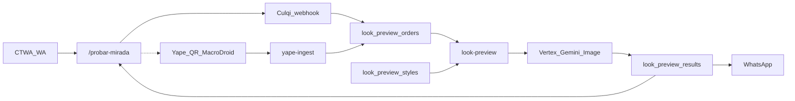

# Plan 07 — Look Preview multi-servicio (CTWA monetización)

> Documento de **producto** para preview virtual pay-first en **todas** las categorías relevantes del salón (no solo extensiones). Léelo antes de tocar schema, Edge, Culqi o `/probar-mirada`.
>
> Spike Vertex + piloto Extensiones (Avril): historial en [Plan 06](./06-PLAN-preview-virtual-extensiones-ctwa.md). Runbook GCP: [`docs/ops/VERTEX_AI_LASH_PREVIEW.md`](../ops/VERTEX_AI_LASH_PREVIEW.md).

**Última actualización:** 2026-09-02  
**Autor:** Alberto Orta (Founder & CTO, ZM Tech)  
**Estado:** Draft producto — naming y arquitectura fijados; implementación pendiente.

---

## 1. Problema e hipótesis

ZM paga CPA CTWA (~S/2–3) por chats que muchas veces **no agendan**. El preview virtual convierte parte de ese tráfico en micro-ingreso (S/5 / S/8) y en intención de cita con look ya elegido.

Plan 06 validó calidad con **Vertex Gemini Image** en Extensiones. Este plan **amplía el mismo motor** a lifting, cejas/microblading, uñas, hidralips, etc., sin una Edge Function por categoría.

| Métrica                                     | Meta piloto (90 días) |
| ------------------------------------------- | --------------------- |
| % chats CTWA elegibles que pagan preview    | ≥ 15 %                |
| Ingreso bruto preview / chat CTWA (blended) | ≥ S/0,80              |
| Preview pagado → `add_to_cart` en 7 días    | ≥ 25 %                |
| Tiempo entrega post-pago                    | ≤ 2 min (p95)         |

**Precios (igual Plan 06):** pack inicial **S/5** (1 look + 2 extra), ampliación **S/8** (+2). Pay-first; sin watermark freemium.

---

## 2. Naming — una sola Edge `look-preview`

| Antes (Plan 06 / scaffold)    | Después (este plan)                                |
| ----------------------------- | -------------------------------------------------- |
| Edge `lash-preview`           | Edge **`look-preview`**                            |
| Tablas `lash_preview_*`       | Tablas **`look_preview_*`**                        |
| Flag `lash_preview_enabled`   | Flag **`look_preview_enabled`**                    |
| Scripts `yarn lash-preview:*` | Preferir `yarn look-preview:*` (alias temporal OK) |

**Decisión:** **no** crear `nails-preview`, `brows-preview`, etc. Misma auth GCP, mismo `vertexGeminiImageEdit`, mismos pagos/órdenes. Solo cambian `category_key` + `prompt_template` (+ foto de referencia opcional).

Código scaffold actual permanece en `supabase/functions/lash-preview/` hasta el PR de rename.

---

## 3. Categorías v1 vs v2

### v1 — Rostro (mismo tipo de selfie)

| `category_key` | Estilos piloto (ejemplos)                           |
| -------------- | --------------------------------------------------- |
| `extensiones`  | Anime, Fox, Wispy, Volumen, Rimel muñeca / Doll-Eye |
| `lifting`      | Lifting natural, lifting + tinte                    |
| `cejas`        | Diseño, laminado                                    |
| `microblading` | Microblading pelo a pelo; combo micro + Doll-Eye    |
| `hidralips`    | Volumen / color natural (labios)                    |

### v2 — Manos / uñas (otro framing de cámara)

| `category_key` | Nota                                                                           |
| -------------- | ------------------------------------------------------------------------------ |
| `unas`         | Requiere foto de manos/uñas, no selfie facial; UX y validación Haiku distintas |

Combo CTWA “Mirada Espectacular” (micro + pestañas) = un `style_key` con prompt compuesto (ver §5).

---

## 4. Arquitectura



- **Identidad clienta:** JWT/link WA (`phone`, `bsuid`, `tenant_id`) al crear la orden — **no** desde la notificación Yape.
- **Motor:** [`_shared/vertex-gemini-image.ts`](../../supabase/functions/_shared/vertex-gemini-image.ts) — un texto concatenado; sin campo `negative_prompt` nativo en `generateContent`.

### Componentes

| Componente                                  | Rol                                       |
| ------------------------------------------- | ----------------------------------------- |
| `apps/web` `/probar-mirada`                 | Selfie, estilo, pago, Realtime, resultado |
| Edge `look-preview`                         | Validación + Vertex + Storage + results   |
| Edge `look-preview-payment` o webhook Culqi | Marca orden `paid` + créditos             |
| Edge `yape-ingest` (opcional)               | POST desde MacroDroid 932                 |
| `look_preview_styles`                       | Catálogo prompts por categoría/estilo     |

---

## 5. Catálogo de prompts (Vertex)

### 5.1 Concatenación en código

```text
{task_directive}

{anatomical_rules_for_style}

{shared_realism_constraints}
Including: Do NOT {negative_items_folded}.

Apply: {positive_look_summary}
```

Una llamada: `vertexGeminiImageEdit({ prompt, imageBytes, referenceImageBytes? })`.

### 5.2 Constraints compartidos (todos los estilos)

- Preserve 100% face shape, skin texture/pores, eye color, lighting, background.
- No sticker / flat mask / floating lashes or brows.
- Soft edge blending; natural lighting on new hairs/pigment.
- Folded Do NOT: cartoonish brows, plastic fake lashes, distorted face, changed eye color, airbrushed skin, heavy face mask, low-res artifacts, oversaturated.

Evitar mantras vacíos tipo “8k”; preferir anclas anatómicas (lash line, brow bone, eyelid curvature).

### 5.3 Plantilla adaptada — Microblading + Doll-Eye

Origen: chat Gemini (ago/sep 2026). Adaptada a **un solo texto** Vertex. Estilo alineado a piloto Avril / “Mirada Espectacular”.

**`style_key` propuesto:** `micro_doll_eye`  
**`category_key`:** `microblading` (o `combo_mirada` si se modela combo aparte)

```text
Act as an expert cosmetic artist and high-end beauty retoucher specializing in eyelash extensions and microblading. Apply a hyper-realistic, non-destructive virtual try-on of Microblading and Doll-Eye mascara-fiber eyelash extensions on the uploaded selfie.

ANATOMICAL RULES:
1. Analyze face shape, eye shape, upper eyelid curvature, brow bone, and natural hair growth before editing.
2. EYEBROW MICROBLADING: Map brows to the client's natural brow bone and arch. Draw fine, crisp hair-by-hair strokes. Softer/lighter at the head; denser/darker at arch and tail. Blend pigment strokes with existing brow hairs.
3. DOLL-EYE LASHES: Shorter lashes on inner and outer corners; maximum length and density at the center of the upper lash line to open the eyes. Thick dark mascara-fiber texture. Anchor every extension into the upper eyelid lash line following eyelid curvature.

REALISM:
Preserve 100% of original face shape, skin texture, pores, eye color, lighting, and background. Integrate hairs with skin lighting and edge shadows. Soft blending on modified areas only.

Do NOT: overlaid sticker effect, floating eyelashes, plastic fake lashes, cartoonish brows, unnatural sharp cutouts, distorted face, changing eye color, altered face shape, airbrushed blurred skin, heavy face mask, low resolution, digital artifacts, oversaturated colors.

Apply: professional salon virtual try-on — seamless hair-by-hair microblading following natural brow arch, plus dark dense Doll-Eye mascara-fiber extensions centered on the upper lash line, photorealistic, natural skin grain preserved.
```

Copy legal (UI): _preview orientativo; el resultado en salón puede variar_.

### 5.4 Catálogo v1 (Gemini + guías Vanessa) — completo

Anexo canónico: [`07-anexo-prompts-vertex-v1.md`](./07-anexo-prompts-vertex-v1.md) — **23/23** `style_keys`.

| Grupo                          | Estilos                                                                                                                          |
| ------------------------------ | -------------------------------------------------------------------------------------------------------------------------------- |
| Extensiones (técnica + efecto) | `clasicas` … `anime` (incl. 3D/4D Natural/Ardilla/Cat Eyes/Ojo abierto, Hawaiana, Fox, Mega, Wispy, Mojado, Rímel)               |
| Combo CTWA                     | `micro_doll_eye` (`combo_mirada`)                                                                                                |
| Otros                          | `lifting_pestanas`, `cejas_diseno`, `cejas_laminado`, `microblading_solo`, `hidralips`, `unas_gel_natural`, `unas_diseno_simple` |

Fuentes: flyers Vanessa + guía Haiku [`extension-effects-guide.ts`](../../supabase/functions/whatsapp-webhook/lib/extension-effects-guide.ts).

**Siguiente:** seed SQL `look_preview_styles` + QA visual por estilo (selfie Avril / manos) antes de prod.

---

## 6. Pagos

| Método                               | Rol             | Notas                                                                                                |
| ------------------------------------ | --------------- | ---------------------------------------------------------------------------------------------------- |
| **Culqi** (tarjeta / Yape vía Culqi) | **Primario**    | Confirmado con Vanessa; automatiza S/5 y S/8; webhook → `paid`                                       |
| **Yape QR estático + MacroDroid**    | Puente opcional | Ref code 4 dígitos en mensaje Yape → `yape-ingest`; validar en 932 que el mensaje aparece en el push |
| **Comprobante WA + Vision**          | Fallback legacy | Flujo citas existente; alta fricción para preview                                                    |

### Culqi (camino feliz)

1. Web crea `look_preview_orders` (`pending_payment`, `session_token`, `phone`/`bsuid`).
2. Clienta paga en Culqi Checkout.
3. Webhook Culqi (Edge) valida firma → `payment_status=paid`, `credits_total`.
4. Realtime en web → “Generando…” → Vertex → `ready`.

### Yape puente (opcional)

1. Web muestra QR Vanessa + código `4821` (“ingresa en Mensaje de Yape”).
2. MacroDroid en 932 escucha noti `com.bcp.innovacxion.yapeapp` → POST `yape-ingest` con secret.
3. Match `payment_ref_code` + monto S/5 → mismo `paid` que Culqi.
4. **Riesgo:** el campo Mensaje puede no venir en la notificación push — spike obligatorio antes de depender de esto.
5. Plan B si no hay mensaje: clienta teclea el **código de seguridad 3 dígitos** Yape en la web.

Secret: `YAPE_INGEST_SECRET` (no `service_role` en el teléfono). Deploy `--no-verify-jwt` + step en `ota-production.yml`.

---

## 7. Modelo de datos (borrador)

```sql
CREATE TABLE look_preview_orders (
  id uuid PRIMARY KEY DEFAULT gen_random_uuid(),
  tenant_id text NOT NULL REFERENCES tenants(id),
  phone text NOT NULL,
  bsuid text,
  client_id uuid REFERENCES clients(id),
  session_token uuid NOT NULL DEFAULT gen_random_uuid(),
  pack text NOT NULL CHECK (pack IN ('initial_s5', 'extra_s8')),
  category_key text NOT NULL,
  style_key text,
  credits_total int NOT NULL,
  credits_used int NOT NULL DEFAULT 0,
  amount_pen numeric(10,2) NOT NULL,
  payment_status text NOT NULL DEFAULT 'pending'
    CHECK (payment_status IN ('pending', 'paid', 'failed', 'refunded')),
  status text NOT NULL DEFAULT 'pending_payment'
    CHECK (status IN (
      'pending_payment', 'paid', 'generating', 'ready', 'failed'
    )),
  payment_provider text,           -- culqi | yape_ingest | manual
  payment_ref text,                -- id Culqi u otro
  payment_ref_code char(4),        -- puente Yape (nullable)
  selfie_path text,
  yape_audit jsonb,
  paid_at timestamptz,
  created_at timestamptz NOT NULL DEFAULT now()
);

CREATE UNIQUE INDEX look_preview_orders_ref_code_pending
  ON look_preview_orders (tenant_id, payment_ref_code)
  WHERE payment_status = 'pending' AND payment_ref_code IS NOT NULL;

CREATE TABLE look_preview_results (
  id uuid PRIMARY KEY DEFAULT gen_random_uuid(),
  tenant_id text NOT NULL,
  order_id uuid NOT NULL REFERENCES look_preview_orders(id),
  style_key text NOT NULL,
  source_storage_path text NOT NULL,
  result_storage_path text NOT NULL,
  haiku_validation jsonb,
  vertex_meta jsonb,
  latency_ms int,
  created_at timestamptz NOT NULL DEFAULT now()
);

CREATE TABLE look_preview_styles (
  id uuid PRIMARY KEY DEFAULT gen_random_uuid(),
  tenant_id text NOT NULL,
  category_key text NOT NULL,
  style_key text NOT NULL,
  display_name text NOT NULL,
  prompt_template text NOT NULL,
  constraints_template text,
  portfolio_image_path text,
  is_active boolean NOT NULL DEFAULT true,
  UNIQUE (tenant_id, category_key, style_key)
);
```

**RLS:** lectura de orden propia vía `session_token` (web pública); staff tenant lee en panel; service_role escribe desde Edge.  
**Realtime:** publicar `look_preview_orders` (y opcionalmente `results`) en `supabase_realtime`.  
**Retención:** job borra selfies/resultados > 30 días sin cita (configurable por tenant).

Migración: alinear `version`/`name` con prod (`supabase-migrations.mdc`). No inventar timestamps.

---

## 8. Flujos de usuario

### 8.1 Web principal (recomendado)

1. Bot CTWA → botón “Ver cómo me quedaría · S/5” → link firmado `/probar-mirada?t=…`.
2. Elegir categoría/estilo → subir selfie (o selfie tras pago — pay-first estricto preferido).
3. Pagar Culqi (o instrucciones Yape puente).
4. Realtime: paid → generating → ready → antes/después.
5. CTA “Agendar con este look” → WABA `add_to_cart` / link agenda.

### 8.2 WhatsApp fallback

Selfie por WA si no abre web en 15 min; gate por `step` para no confundir con foto diseño / `bot_paused_at`.

### 8.3 Feature flag

`waba_config` / `tenant_settings`: `look_preview_enabled` por `tenant_id`.

---

## 9. Fases de implementación

### Fase A — Rename + ops Vertex

- [ ] Renombrar Edge `lash-preview` → `look-preview` + step CI `ota-production.yml`.
- [ ] Secrets prod: `GCP_SERVICE_ACCOUNT_BASE64`, `GCP_LOCATION`, `GEMINI_IMAGE_MODEL`.
- [ ] Deploy + smoke `GET` health.
- [ ] Actualizar runbook / scripts alias.

### Fase B — Culqi MVP (Extensiones / 1 categoría)

- [ ] Migración `look_preview_*`.
- [ ] `/probar-mirada` + JWT sesión WA.
- [ ] Webhook Culqi → `paid` → generar 3 looks.
- [ ] Entrega WA + Realtime web.
- [ ] Seed estilos Extensiones (+ `micro_doll_eye` si CTWA Mirada).

### Fase C — Catálogo multi-estilo

- [ ] Prompts Gemini para lifting / cejas / hidralips / etc. (§5.4).
- [ ] Panel L2: ON/OFF estilos, precios.
- [ ] Pack S/8 + retención Storage.

### Fase D — Puente Yape (opcional)

- [ ] Spike 932: mensaje en noti Yape.
- [ ] MacroDroid + `yape-ingest` + `payment_ref_code`.
- [ ] Dedup / audit `yape_audit`.

### Fase E — Geema

- [ ] Port `look-preview` + preset `spa-nails`; default OFF en 2.º tenant.
- [ ] Ticket S6 en roadmap Geema.

---

## 10. Definition of Done (piloto ZM)

- [ ] Clienta CTWA puede pagar S/5 (Culqi), subir selfie y recibir 3 imágenes en < 2 min (p95).
- [ ] Selfie inválida → mensaje claro sin consumir crédito.
- [ ] Edge pública llamada **`look-preview`** (no `lash-preview`).
- [ ] Al menos 2 `category_key` con estilos activos (ej. extensiones + micro/combo).
- [ ] No dispara `bot_paused_at` / foto diseño por error.
- [ ] Suite QA `yarn waba:validate:look-preview` + `yarn waba:cleanup:qa`.
- [ ] 20 previews reales; feedback Vanessa/staff ≥ 4/5.
- [ ] Entrada `CHANGELOG.md` + fila `ROADMAP.md`.

---

## 11. Riesgos

| Riesgo                              | Mitigación                                              |
| ----------------------------------- | ------------------------------------------------------- |
| Calidad inconsistente por categoría | QA staff por estilo; prompts anatómicamente específicos |
| Culqi onboarding / liquidación      | Coordinar con Vanessa; sandbox antes de prod            |
| Mensaje Yape no llega al push       | Spike MacroDroid; plan B código 3 dígitos en web        |
| MIUI mata MacroDroid                | Autostart + batería sin restricción en 932              |
| Latencia 3× ~26 s                   | UX progreso; paralelo o secuencial con estados          |
| Costo Vertex > margen S/5           | Monitoreo panel; créditos GCP piloto                    |
| Rename rompe CI/scripts             | Un PR: carpeta Edge + workflow + yarn scripts           |

---

## 12. Fuera de scope

- App nativa AR en vivo.
- App Android custom (MacroDroid basta para puente).
- Offline conversions Meta por preview (evaluar después).
- Entrenar modelos con selfies de clientas.
- Preview barbershop / hair-salon (Geema verticales distintas).

---

## 13. Capas Geema

| Capa | Look preview                                                |
| ---- | ----------------------------------------------------------- |
| L1   | Edge `look-preview`, Vertex, sesión WA                      |
| L2   | Precios, ON/OFF, estilos, copy CTA, portafolio              |
| L3   | `look_preview: { enabled, packs, styles[], retentionDays }` |
| L4   | Preset `spa-nails`; otras verticales off o roadmap          |

---

## 14. Referencias

| Doc                                                                                          | Relación                                          |
| -------------------------------------------------------------------------------------------- | ------------------------------------------------- |
| [06-PLAN-preview-virtual-extensiones-ctwa.md](./06-PLAN-preview-virtual-extensiones-ctwa.md) | Spike Vertex + piloto Extensiones                 |
| [07-anexo-prompts-vertex-v1.md](./07-anexo-prompts-vertex-v1.md)                             | Prompts VERTEX_READY por `style_key` (v1 parcial) |
| [VERTEX_AI_LASH_PREVIEW.md](../ops/VERTEX_AI_LASH_PREVIEW.md)                                | Runbook GCP (actualizar título/alias en Fase A)   |
| [04-PLAN-ctwa-collages-cierre-intencion.md](./04-PLAN-ctwa-collages-cierre-intencion.md)     | Entrada CTWA                                      |
| [02-PLAN-retrofit-tenant-id.md](../02-PLAN-retrofit-tenant-id.md)                            | `tenant_id`                                       |
| `supabase/functions/_shared/vertex-gemini-image.ts`                                          | Cliente Vertex                                    |
| `supabase/functions/lash-preview/`                                                           | Scaffold pre-rename                               |

---

## 15. Sync Geema

Al cerrar Fase B/C: enlazar este plan en `zm-tech` y ticket **S6 — Look preview spa-nails** en [04-ROADMAP-SPRINTS.md](./geema-migration/04-ROADMAP-SPRINTS.md).
